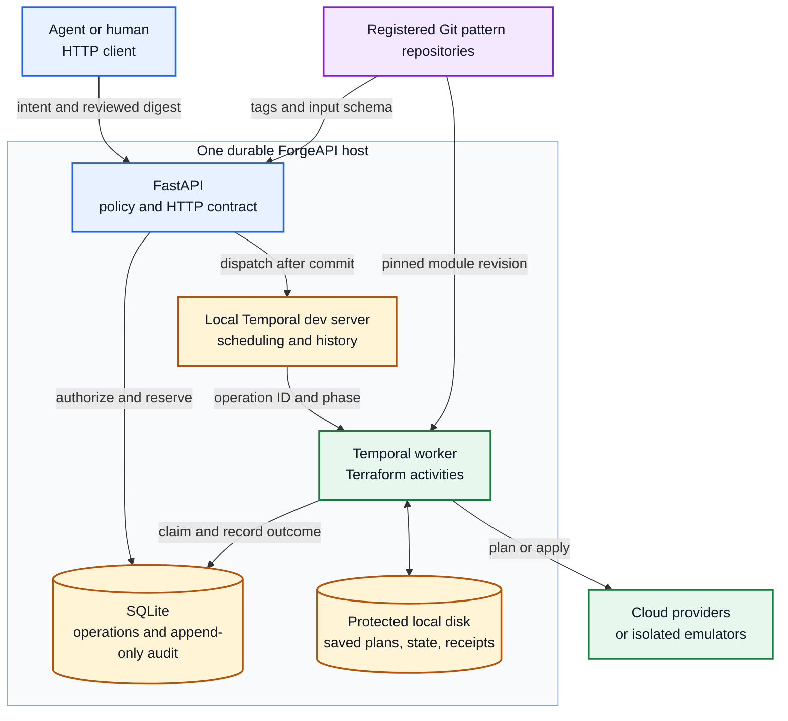
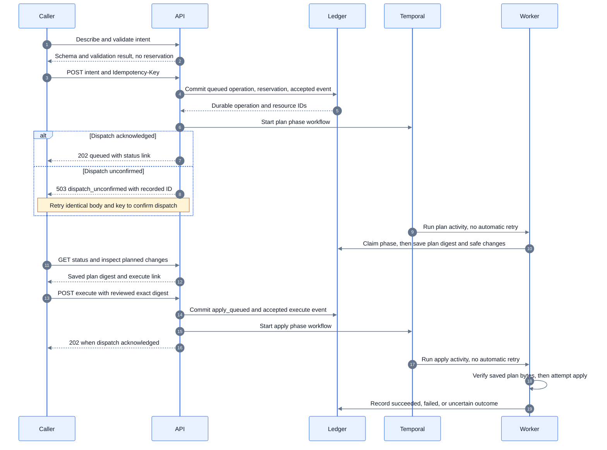
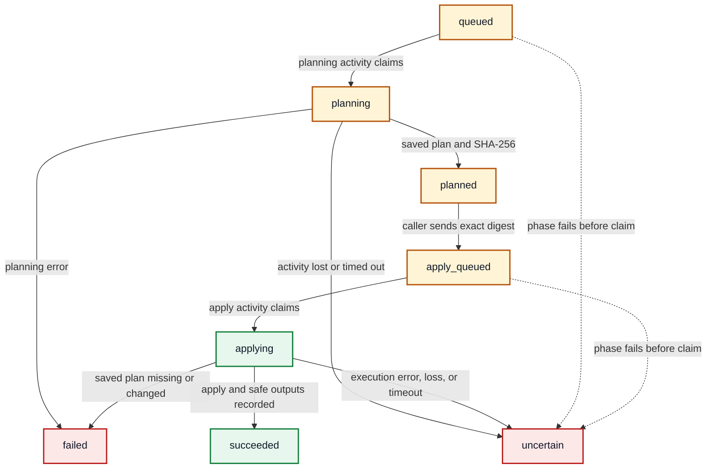
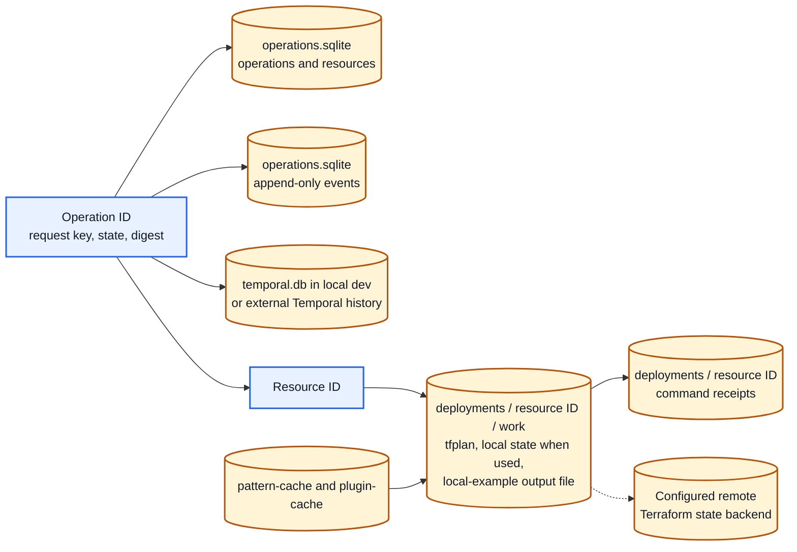
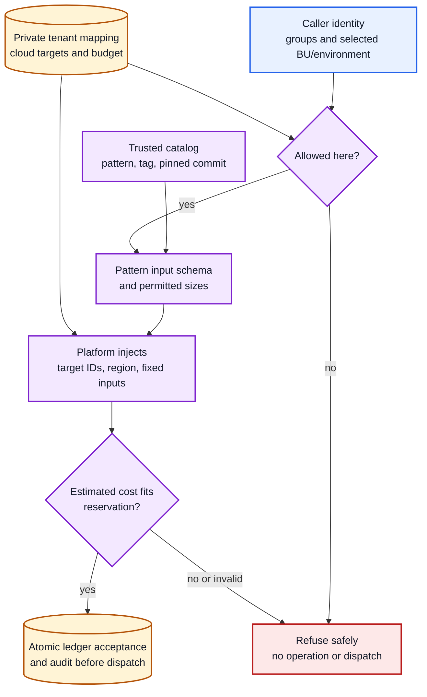

# ForgeAPI: infrastructure requests with an explicit plan gate

ForgeAPI lets an agent request approved infrastructure through HTTP, inspect a saved Terraform plan, and explicitly execute **that same plan**. FastAPI owns admission and the durable operation ledger; Temporal uses separate plan and apply phase workflows; the worker runs Terraform activities. The agent never receives cloud executor credentials or runs Terraform itself.

**Status (2026-10-04):** merged on `main`; the GitHub-hosted Check workflow (lint, tests, image build and Trivy scan) passes. The default suite passes **1181 tests** (31 optional tests skipped: Floci emulators and real Microsoft Graph) on Terraform 1.15.9 and 1.16.5. Features are proven through the real stack (HTTP API → Temporal → worker → Terraform → Floci AWS/Azure/GCP); caller sign-in is verified with real Entra tokens. **Released as v1.0.0**: public images `ghcr.io/azskylab/forgeapi:v1.0.0` (`sha256:3b67bcdb6821e4211dfd7c7801ec9c1582242521fae61b0794f55a22a107a633`) and `ghcr.io/azskylab/forgeapi-engine:v1.0.0`. **Not yet deployed** to a hosted environment: the [AKS base](deploy/aks/README.md) is rehearsed on a local kind cluster. [Evidence and remaining gates](docs/progress.md) · [Session handoff](docs/session-handoff.md)

## Contents

- [How it fits together](#how-it-fits-together)
- [Run it locally](#run-it-locally)
- [Make one request and review its plan](#make-one-request-and-review-its-plan)
- [HTTP client](#http-client)
- [Operation states and recovery](#operation-states-and-recovery)
- [What must survive a restart](#what-must-survive-a-restart)
- [Placement, identity, budgets, and secrets](#placement-identity-budgets-and-secrets)
- [Versions and compatibility](#versions-and-compatibility)
- [Verification and deeper guides](#verification-and-deeper-guides)

## How it fits together

The API and worker must share **one host and durable local disk** for the operation ledger, Terraform state, and saved plans. The diagram shows the local development topology, with a persistent Temporal dev server on that host. An existing Temporal service can replace **only that scheduling/history role**; it does **not** make the SQLite ledger or plan files remote. The worker runs the trusted, registered pattern; patterns live in separate Git repositories and resolve from tags to pinned commits. The bundled `local-file` example is unversioned and needs no cloud account.



The API exposes the plan's **address, resource type, and action summary**, never raw plan values. Planning alone cannot create the requested resource. Only an explicit execution request with the saved binary plan's SHA-256 digest can start apply. Temporal workflows are deterministic; within Temporal execution, database and Terraform I/O live in activities. The API also writes its ledger during admission and reads Git catalog metadata. The current architecture has no MCP server or server-side model. [Design and failure boundaries](docs/agent-architecture.md)

## Run it locally

Use Python/`uv` to start the API without auth, Azure, Docker, or credentials. For the **complete plan-and-apply example**, also run Temporal, a worker, Git, and Terraform. Acceptance can commit before Temporal is available, but returns an unconfirmed-dispatch 503 until the same request is retried and acknowledged. The SDK downloads its local Temporal dev server on first use. Run these in separate terminals from the repository root:

```sh
uv sync
uv run uvicorn app.main:app --reload
```

```sh
uv run python -m app.devserver
```

```sh
uv run python -m app.worker
```

The unauthenticated API should stay on loopback. API and worker use the same `FORGEAPI_DATA_DIR` (default `.local/data`); the local dev server keeps history there as `temporal.db`. If using an existing Temporal service, configure `FORGEAPI_TEMPORAL_ADDRESS`, namespace, and task queue consistently for the API and worker. `GET /healthz` means the API process is live. `GET /readyz` also proves a ledger read and a Temporal health call succeed (503 names the failing check); neither proves Git, Terraform, or a cloud provider is available. For a packaged API/engine pair and shared-volume requirements, see the [work deployment brief](docs/work-deployment.md).

| Setting | Purpose |
| --- | --- |
| `FORGEAPI_DATA_DIR` | Shared local ledger, workspaces, plans, state, and local Temporal history path. |
| `FORGEAPI_CATALOG_PATH` | Trusted pattern registry; defaults to `patterns.yaml`. |
| `FORGEAPI_TEMPORAL_ADDRESS`, `FORGEAPI_TEMPORAL_NAMESPACE`, `FORGEAPI_TASK_QUEUE` | Where the API dispatches and the worker listens; defaults target local Temporal. |
| `FORGEAPI_AUTH_MODE` | `none` for loopback development; `entra` validates bearer tokens; `easyauth` trusts its principal header only behind a proxy that strips caller-supplied copies. |
| `FORGEAPI_TENANTS_PATH` | Private business-unit mapping; unset uses single-tenant rules. Caller identity is separate from the worker's cloud execution identity. |

## Make one request and review its plan

This local example writes a file inside an isolated Terraform workspace. Save the exact intent and keep its key: they are the recovery identity if a network response is lost. The commands below each perform **one** requested step; replace the uppercase IDs and digest with actual returned values. Read `changes` before executing.

```sh
cat > intent.json <<'JSON'
{
  "pattern": "local-file",
  "inputs": {
    "filename": "smoke.txt",
    "content": "created through a reviewed plan"
  }
}
JSON

uv run python -m app.client --url http://127.0.0.1:8000/v1 discover
uv run python -m app.client --url http://127.0.0.1:8000/v1 patterns
uv run python -m app.client --url http://127.0.0.1:8000/v1 describe local-file
uv run python -m app.client --url http://127.0.0.1:8000/v1 validate --body intent.json
uv run python -m app.client --url http://127.0.0.1:8000/v1 submit --body intent.json --key smoke-1
uv run python -m app.client --url http://127.0.0.1:8000/v1 status OPERATION_ID

# After state is "planned", inspect changes and copy its plan_digest yourself.
uv run python -m app.client --url http://127.0.0.1:8000/v1 execute OPERATION_ID --digest REVIEWED_SHA256
uv run python -m app.client --url http://127.0.0.1:8000/v1 status OPERATION_ID
uv run python -m app.client --url http://127.0.0.1:8000/v1 events OPERATION_ID --limit 20
```

Validation checks the request but reserves nothing and runs no Terraform. Submission atomically records a queued operation, its resource reservation, and an `accepted` audit event. The API then asks Temporal to schedule planning and returns `202` **after dispatch is acknowledged**, without waiting for Terraform. If dispatch cannot be confirmed after acceptance, the API returns `503 dispatch_unconfirmed` with the recorded operation ID and `retry_same_request`. Retry the **identical body and key**; a fresh key could create a second resource for a create intent, or conflict if an existing resource ID was explicit. Without that retry, accepted work may remain queued.



A Git pattern should use its tag in `version` and set `expected_commit` to the commit returned by validation; a moved tag is refused. An update uses a new key, the existing `resource_id`, and complete desired inputs. A destroy uses a new key, `action: "destroy"`, its pattern, and the same resource ID. Both produce a **new plan requiring explicit execution**. Do not use the local example's unversioned behavior as the contract for Git patterns.

## HTTP client

`/v1` is the canonical operation contract. Each business route below also exists at the root as a **v1 alias**, with the same handlers, caller/key scope, and ledger; links and `Location` retain the route family used. `/healthz` and `/readyz` are unversioned. The canonical schema is `/v1/openapi.json`; `/openapi.json` retains the root route surface. The previous `/deployments` API is isolated at `app.legacy:app` and is not an operation route.

| Purpose | Canonical route | Meaning |
| --- | --- | --- |
| Onboard a pattern | [docs/pattern-onboarding.md](docs/pattern-onboarding.md) | Template, `python -m app.pattern_check`, register, `GET /patterns/{name}/check` |
| Multi-cloud HA app | [docs/ha-apps.md](docs/ha-apps.md) | Replicas per cloud + Route 53 failover router; failover is a reviewed plan |
| Developer portal | `GET /console` | My infrastructure, jobs, history, budgets, projects, landing zones, fleet, apps, self-service deploy, team admin; apply/discard with confirmation |
| HA app rollout | `POST /v1/apps`, `GET /v1/apps/{id}`, `POST /v1/apps/{id}/approve` | Replicas + router in one request; two exact-digest approval gates; never auto-applies |
| App failover / teardown | `POST /v1/apps/{id}/failover`, `/destroy`, `/discard` | Swap the primary through a reviewed router plan; ordered, gated teardown |
| Fleet | `POST /v1/resources/{id}/drift-check`, `/upgrade`, `/promote` | Read-only drift check; re-plan at a new version keeping inputs; copy to another environment at the same commit |
| Pattern changes and checks | `GET /v1/patterns/{name}/changes`, `/check` | Commits and input diff between versions; static contract checks at the pinned commit |
| Cost history | `GET /v1/budgets/history` | Daily reserved cost per landing zone, rebuilt from the ledger |
| Team admin | `/v1/admin/teams…` | Operators only, with `FORGEAPI_TENANTS_SOURCE=db`: create, edit (`If-Match`), validate, revisions, revert, archive, import |
| Discovery | `GET /v1/agent` | Contract, links, capabilities, allowed patterns |
| Pattern details | `GET /v1/patterns/{name}` | Inputs, versions, resolved commit, caller-visible metadata |
| Dry validation | `POST /v1/intents/validate` | Validate without admission or Terraform planning |
| Submit | `POST /v1/operations` | `Idempotency-Key` required; queue planning |
| List | `GET /v1/operations` | Visible operations; offset or advertised stable cursor |
| Status | `GET /v1/operations/{id}` | State, safe plan summary, digest, next action |
| Events | `GET /v1/operations/{id}/events` | Append-only operation trail, paged by sequence |
| Execute | `POST /v1/operations/{id}/execute` | Explicit saved `plan_digest`; queue apply |
| Discard | `POST /v1/operations/{id}/discard` | Reject a `planned` operation; it ends `failed` and releases the resource and budget reservation |
| Catalog | `GET /v1/patterns` | Patterns the caller may use, with cloud and describe link |
| Inventory | `GET /v1/resources`, `GET /v1/resources/{id}` | Resources the caller may see, with state, last applied outputs and latest operation; filter by `pattern`, `environment`, `state`, `label` |
| Reconcile | `POST /v1/operations/{id}/reconcile` | Operator only: record an `uncertain` operation as `succeeded` or `failed` after inspecting state; releases the resource |

Use HTTP or the importable [`Client`](app/client.py) / `python -m app.client`. The bundled client discovers same-origin links, requires HTTPS outside loopback, refuses redirects and inherited proxies, and never obtains or stores credentials. The quickstart's explicit `/v1` base targets this runtime; for an older server, use the root base URL so the client bootstraps through `/agent` and follows its advertised links. For authenticated use, set the short-lived `FORGEAPI_CLIENT_TOKEN` at runtime, not in a command argument or file. The client does not automatically retry a mutation, execute a plan, or traverse pages. A contradictory submission response remains an ambiguous mutation: retain the original body/key and do not trust the contradictory operation ID.

For operation pagination, check discovery's `stable_operation_pagination` capability. Fetch `operations --limit 20`, then use its `next_before` with `operations --before OPERATION_ID` until null. Cursor pages are stable against new insertions, though item states can change. Older offset/`next_offset` pages remain available; new insertions can shift them. Do not combine `before` with nonzero `offset`. For events, pass the returned `next_after` to `events --after EVENT_SEQUENCE` until null. Each client call fetches one page. The client accepts older discovery without optional capability metadata, but will not assume a missing capability authorizes cursor mode. [Compatibility rules](docs/api-versioning.md)

### Organizing and composing resources

- `labels` on a deploy intent tag the resource (`GET /v1/resources?label=team=platform`); they are metadata only and never reach Terraform.
- `input_refs` copies a public output of a `ready` resource you can see (same business unit and environment) into an input at acceptance: `{"input_refs": {"resource_group_name": {"resource_id": "res_…", "output": "name"}}}`. A referenced resource cannot be destroyed while a `ready` resource uses it.
- An update intent naming another `version` upgrades the resource through a reviewed plan (state must live outside the workspace, e.g. the azurerm backend).
- Discovery shows each environment's guardrails (`allow_destroy`, `protected_resource_types`) and budget headroom (`monthly_budget`, `reserved`, `available`).
- A `failed` or `uncertain` operation caused by Terraform shows a sanitized `diagnostic` (Terraform's first error; placement IDs, URLs and auth errors never appear).
- With `FORGEAPI_PLAN_MAX_AGE_HOURS` set, unexecuted plans expire (`plan_expires_at`; execute returns 409 `plan_expired`).

## Operation states and recovery

An operation is the durable request/plan/outcome; a resource is the Terraform state identity across operations. The state machine deliberately has **no automatic exit from `uncertain`**. A Terraform apply may have changed the provider before the worker lost its result; neither a retry nor a second plan is safe to infer from an HTTP timeout.



The ledger fences claims and late results. Temporal plan/apply activities have `maximum_attempts=1`; the idempotent status writer may retry. A phase failure or timeout can mark `queued`/`planning` or `apply_queued`/`applying` as `uncertain`, depending on whether its activity claimed the ledger row. Planning and applying have 10- and 30-minute activity timeouts respectively, but those timeouts do **not** kill a surviving Terraform subprocess. `uncertain` is terminal for polling, yet its resource reservation remains and blocks replacement work until an operator examines state and provider evidence. There is no automatic apply retry, replan during execution, force-unlock, or reconciliation endpoint. A `failed` plan or a missing/changed saved plan is distinct from uncertainty after an apply attempt. [Interruption and dispatch-crash evidence](docs/agent-architecture.md#runtime-and-failure-boundary)

| Observation | Safe next step |
| --- | --- |
| `503 dispatch_unconfirmed` with recorded operation ID | Keep the same body/key or operation/digest and retry to confirm dispatch. The accepted row already exists. |
| Fixed `503 operation ledger unavailable` or `audit unavailable` | No accepted dispatch is confirmed. Restore storage, then check status and retry the same identity; do not invent a fresh key. |
| `422`, `403`, or `409` | Inspect the structured error and correct the request or permissions. A conflicting key is not a transport retry. |
| `uncertain` | Stop mutation of that resource and have an operator reconcile ledger, Terraform state, and provider evidence. No automated recovery path exists. |

An identical retry can return the **same, already progressed operation** with `202`; that response is not proof of a newly scheduled activity. Do not infer cloud exactly-once behavior from HTTP idempotency alone.

## What must survive a restart

The operation ledger, Temporal history, and Terraform artifacts describe **different parts of the same operation**. Keep their identity, paths, configuration, and compatible toolchain together. The worker may resume a queued activity after a restart; it must not be given a different saved plan under the same digest.



With the default settings, local files sit under `.local/data/`; in the packaged image the shared mount is `/data` and must be writable by UID 1000 in both API and engine containers. A pattern can configure a remote Terraform state backend, which must be protected and backed up separately. Protect both stores: **binary plans and Terraform state can contain secrets**, even though raw plans, provider diagnostics, and sensitive output values are not published or logged by the API. Command logs contain command/exit receipts. Temporal history carries operation IDs and phase names, not request bodies.

`tfplan` is the current saved plan in a resource's workspace, not an immutable archive. The worker removes it after the Terraform apply command returns successfully, before public outputs and the final operation state are recorded. Preserve the whole workspace for pending plans and stateful updates; do not copy only `operations.sqlite`.

For a backup, stop admissions and **all writers**, including surviving Terraform children, then copy the entire protected data directory at one quiesced point. Restore with writers stopped, the original absolute paths and configuration, and a compatible toolchain. A stale backup cannot establish what the provider did after the snapshot; reconcile before resuming. The local restore test covers a stopped whole-tree copy and one pending exact-plan execution, not a live backup or cloud recovery. An external Temporal service and cloud/emulator state need their own protection. [Backup and runtime detail](docs/agent-architecture.md#runtime-and-failure-boundary)

## Placement, identity, budgets, and secrets

Without a tenant mapping, the API uses single-tenant operation rules. Independently, the local default is `FORGEAPI_AUTH_MODE=none`; hosted auth and placement are configured separately. In a placed deployment, the caller selects an allowed business unit, environment, and catalog pattern; **the platform** selects cloud target, region, injected variables, and budget policy. Caller-supplied values for injected variables are refused. The accepted resource cannot silently move to another target; execution and later changes recheck current permission and target identity. The API identity should have no Terraform cloud-deploy rights; the worker holds that execution role. `FORGEAPI_AUTH_MODE=entra` is verified with real tokens from a lab Entra tenant: missing, garbage and wrong-audience tokens get 401, and callers see only the business units and environments their groups grant. Opt-in `FORGEAPI_LIVE_GROUP_CHECKS` re-checks an app requester's current Entra groups through Microsoft Graph before work the API later accepts in their name. Easy Auth behind a hosted proxy remains unverified. On AKS the worker uses workload identity; that path is proven against the Floci Azure emulator, not yet against real Entra.



Budget estimates are admission rules, not bills. When configured, SQLite serializes reservation checks against contributing current, failed, and uncertain resources; a missing estimate cannot be treated as free. Invalid cost configuration or stored accounting data fails safely before new acceptance. Exact-key replay and destroy retain their existing paths. [Placement and budget contract](docs/tenancy.md)

Every accepted mutating action is audited **before dispatch**; refused mutations are audited without submitted values. Reads and validation-only requests do not append refusal events. If acceptance or its required audit cannot be recorded, the action is not dispatched. The audit table has append-only triggers, but it is not an external immutable log. Caller visibility hides other business units' operation IDs and event trails. [Architecture audit rules](docs/agent-architecture.md#policy-and-data)

Patterns should pass **secret references**, not secret values, and mark sensitive outputs. The API withholds sensitive output values, lists their names in `withheld_outputs`, and also withholds outputs containing known placement IDs. Public plan summaries are rejected if they disclose those IDs. Strict JSON validation happens after output filtering; an invalid public output after apply becomes `uncertain`, preserving its reservation. Private Terraform state and plans still require disk protection. [Outputs and secret conventions](docs/outputs.md)

## Versions and compatibility

These axes evolve independently. A changed API release or route spelling must not rewrite a caller's accepted request identity.

| Axis | Current meaning | Compatibility rule |
| --- | --- | --- |
| HTTP contract | `agent-v1`, canonical `/v1`, root v1 aliases | Preserve existing v1 requests, statuses, defaults, pagination, and execution meanings; new optional behavior needs a capability. |
| Application release | `1.0.0` in discovery | A release number describes code, not the API major or a Terraform pattern revision. This working tree is unreleased. |
| Pattern revision | Git tag resolved to a commit at acceptance | Pin the commit in the operation; `expected_commit` detects a moved tag between validation and submit. Local examples are unversioned. |
| Persistent execution | SQLite ledger, saved plan, Temporal history, Terraform/toolchain | API compatibility alone does not prove replay, schema migration, downgrade, or mixed-worker compatibility. Preserve and test affected history and artifacts. |

Older conforming v1 clients may ignore **additive response fields**, but unknown request fields remain errors and unfamiliar operation states or `next_action` instructions require a safe stop. New clients can use older servers only for shared capabilities: missing discovery metadata means the baseline contract, not permission for an optional feature. Root and `/v1` aliases share the same caller/key fingerprint and operation; a release number does not change it. The bundled client performs bounded compatibility checks but does not claim arbitrary future-server support. Read the [versioning policy](docs/api-versioning.md) before changing a route, request field, ledger shape, workflow, or dependency.

## Verification and deeper guides

```sh
uv run pytest
uv run ruff check .
```

The normal suite includes local HTTP, SQLite, Git catalog, real Temporal/Terraform lifecycle, interruption, replay, and quiesced restore coverage. It also covers Temporal TLS/mTLS through a real handshake (`tests/test_temporal_tls_live.py`). Optional three-cloud Floci tests run only with `--floci` (start `docker compose -f compose.floci.yaml -p forgeapi-floci up -d`, then `uv run pytest --floci tests/test_floci*.py`: lifecycle, placed features, composition, version upgrades, fleet drift/upgrade, HA app rollout/failover/teardown and AKS workload identity through real Temporal); the opt-in real-Graph test needs `FORGEAPI_TEST_ENTRA_OID`, `FORGEAPI_TEST_ENTRA_MEMBER_GROUP` and `FORGEAPI_TEST_ENTRA_NONMEMBER_GROUP` plus an `az` login; their setup and lifecycle commands are in the [emulator guide](deploy/emulator/README.md) and [placement demo](deploy/emulator-placement/README.md). Floci is an emulator, so those results do not establish real-cloud IAM, billing, or regional behavior. The isolated current-image smoke used a fresh Docker volume and local-file pattern; its safe evidence is described in [progress](docs/progress.md). The hosted Check workflow has passed on GitHub and v1.0.0 images are published with SBOM and provenance; a controlled hosted upgrade and work-cloud identity remain unverified. Do not treat a local build as those release gates.

| For… | Read… |
| --- | --- |
| Current state, actual test/image evidence, retained resources | [Progress](docs/progress.md) and [session handoff](docs/session-handoff.md) |
| End-to-end design and failure boundaries | [Agent architecture](docs/agent-architecture.md) |
| Client/server upgrade rules | [API versioning](docs/api-versioning.md) |
| Tenant mapping, cloud placement, budget reservations | [Tenancy](docs/tenancy.md) |
| Secret and output conventions | [Outputs](docs/outputs.md) |
| Onboarding a new Terraform pattern | [Pattern onboarding](docs/pattern-onboarding.md) |
| Multi-cloud HA apps | [HA apps](docs/ha-apps.md) |
| Audit trail | [Audit](docs/audit.md) |
| Deploying on AKS (and the local kind rehearsal) | [AKS base](deploy/aks/README.md) |
| Implementing this at work (from the earlier version running there) | [Work handover](docs/work-handover.md), then the [work deployment brief](docs/work-deployment.md); start the session with the [work prompt](docs/work-prompt.md) |
| Legacy `/deployments` material | [Archived Temporal guides](docs/archive-temporal/README.md) via the [handoff](docs/session-handoff.md) |

`app.legacy:app` retains the previous deployment API for existing state. It was not migrated into `operations.sqlite`; do not run legacy mutations against the same resources or budgets concurrently with the new operation API.
