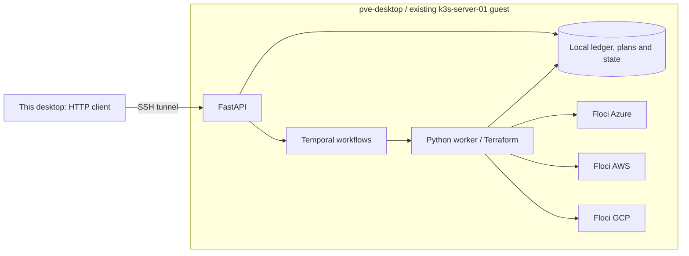

# Work-cloud simulation on pve-desktop

Current as of: 2026-09-30. Single-host development deployment, unreleased.



The API provisions cloud patterns for Azure, AWS and GCP. Floci substitutes their cloud
endpoints. The home lab supplies hosting for this work simulation. No Proxmox provisioning
API or dedicated database VM is part of the solution.

## Placement and access

- Existing guest: `k3s-server-01`, `10.0.20.10`, VM 200 on `pve-desktop`.
- Namespace/deployment: `forgeapi-emulator`. One pod, pinned to that node, with five containers.
- Local storage: `/var/lib/forgeapi-emulator`, mode 0700, UID/GID 1000. API and worker share it.
- API binds pod loopback. No Service or Ingress. Namespace NetworkPolicy denies pod ingress.
- SSH and Kubernetes port-forward provide access from this desktop. SSH is the access boundary;
  application authentication remains off in this isolated demo. Do not publish it on the LAN.
- No Kubernetes service-account token, cloud credential, Docker socket or hypervisor access is
  mounted. Emulator tokens/IDs in the example patterns are dummy values.

Run this in a desktop terminal to connect (leave it running):

```sh
ssh -o ExitOnForwardFailure=yes -o ServerAliveInterval=30 \
  -L 127.0.0.1:28000:127.0.0.1:28000 \
  -L 127.0.0.1:28233:127.0.0.1:28233 \
  -L 127.0.0.1:24566:127.0.0.1:24566 \
  -L 127.0.0.1:24577:127.0.0.1:24577 \
  -L 127.0.0.1:24588:127.0.0.1:24588 ubuntu@10.0.20.10 \
  'sudo k3s kubectl -n forgeapi-emulator port-forward --address 127.0.0.1 deployment/forgeapi-emulator 28000:8000 28233:8233 24566:4566 24577:4577 24588:4588'
```

| Desktop endpoint | Remote service |
| --- | --- |
| `http://127.0.0.1:28000/docs` | API Swagger UI |
| `http://127.0.0.1:28000/agent` | Agent discovery and permitted catalog |
| `http://127.0.0.1:28233` | Temporal UI |
| `127.0.0.1:24566`, `:24577`, `:24588` | AWS, Azure, GCP independent readback |

Reconnect the tunnel after a pod replacement or desktop restart. If the ports are already
in use by the existing tunnel, use that connection. Nothing on the desktop executes Terraform.

## Verify through the remote HTTP API

```sh
curl -fsS http://127.0.0.1:28000/agent
python3 deploy/emulator/verify.py --evidence .local/pve-floci/evidence/lifecycle.json
# Optional: create one resource per cloud and retain them for inspection:
python3 deploy/emulator/verify.py --keep --evidence .local/pve-floci/evidence/retained.json
```

The standard-library client validates each intent, accepts a plan asynchronously, checks
duplicate calls, confirms absence before execution, executes the digest, checks safe outputs
and ordered events, then independently confirms presence. Without `--keep`, it also plans and
executes destroy and confirms absence. It uses real HTTP across SSH to the server, where
Temporal and Terraform run. It cleans up only the resources created in that invocation.

## Deploy the current working tree

This is an explicitly manual demo deployment. No commit, registry push or ArgoCD mutation
is needed. Run from this repository. Namespace creation is a first-install step.

```sh
docker build -t forgeapi:floci-work-demo .
docker save -o /tmp/forgeapi-work-demo-image.tar forgeapi:floci-work-demo
ssh ubuntu@10.0.20.10 'sudo install -d -m 0700 -o 1000 -g 1000 /var/lib/forgeapi-emulator; mkdir -p /tmp/forgeapi-emulator; sudo k3s kubectl create namespace forgeapi-emulator'
scp /tmp/forgeapi-work-demo-image.tar deploy/emulator/bootstrap.py deploy/emulator/engine.py deploy/emulator/pve-desktop.yaml ubuntu@10.0.20.10:/tmp/forgeapi-emulator/
ssh ubuntu@10.0.20.10 'sudo k3s ctr images import /tmp/forgeapi-emulator/forgeapi-work-demo-image.tar'
ssh ubuntu@10.0.20.10 'sudo k3s kubectl -n forgeapi-emulator create configmap forgeapi-emulator-scripts --from-file=/tmp/forgeapi-emulator/bootstrap.py --from-file=/tmp/forgeapi-emulator/engine.py --dry-run=client -o yaml | sudo k3s kubectl apply -f -'
ssh ubuntu@10.0.20.10 'sudo k3s kubectl apply -f /tmp/forgeapi-emulator/pve-desktop.yaml'
ssh ubuntu@10.0.20.10 'sudo k3s kubectl -n forgeapi-emulator rollout status deployment/forgeapi-emulator'
```

The image pull policy is `Never`: it uses the locally imported image on the pinned node.
On an image-only upgrade, a deliberate rollout restart is required after import. Only do
that with no executing operations, and expect emulator state loss. Initialization creates
separate local git repos tagged `v1.0.0` from the three example root modules. Subsequent starts
preserve them; changed fixture content fails initialization until explicitly versioned.

## Storage and limits

The protected server directory contains `operations.sqlite`, `temporal.db`, catalog repos,
Terraform state, saved plans and the provider cache. It survives pod replacement. Back up
with the deployment stopped. Never remove that directory to reset an emulator.

Emulator volumes are disposable. Provider resources can disappear when the pod or emulator
restarts. A completed operation describes past execution; it does not imply current resource
existence. Inspect and replan on the same resource ID after cloud state loss. Never reapply
the old saved plan. Refresh the engine's CA trust after an Azure emulator CA change.

The earlier desktop-only Azure demo at port 18000 remains independent and unchanged.
This simulation verifies one pattern per provider: Azure resource group, AWS S3 bucket,
GCP storage bucket. It does not establish real-cloud identity/permissions, all resource types,
production Temporal, distributed operation storage or deployment readiness at work.

To stop the server demo without deleting its persistent data:

```sh
ssh ubuntu@10.0.20.10 'sudo k3s kubectl -n forgeapi-emulator scale deployment/forgeapi-emulator --replicas=0'
```

Scaling back to one starts fresh emulator state. Preserve the data directory and inspect
existing resource IDs before further execution.
