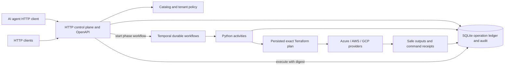
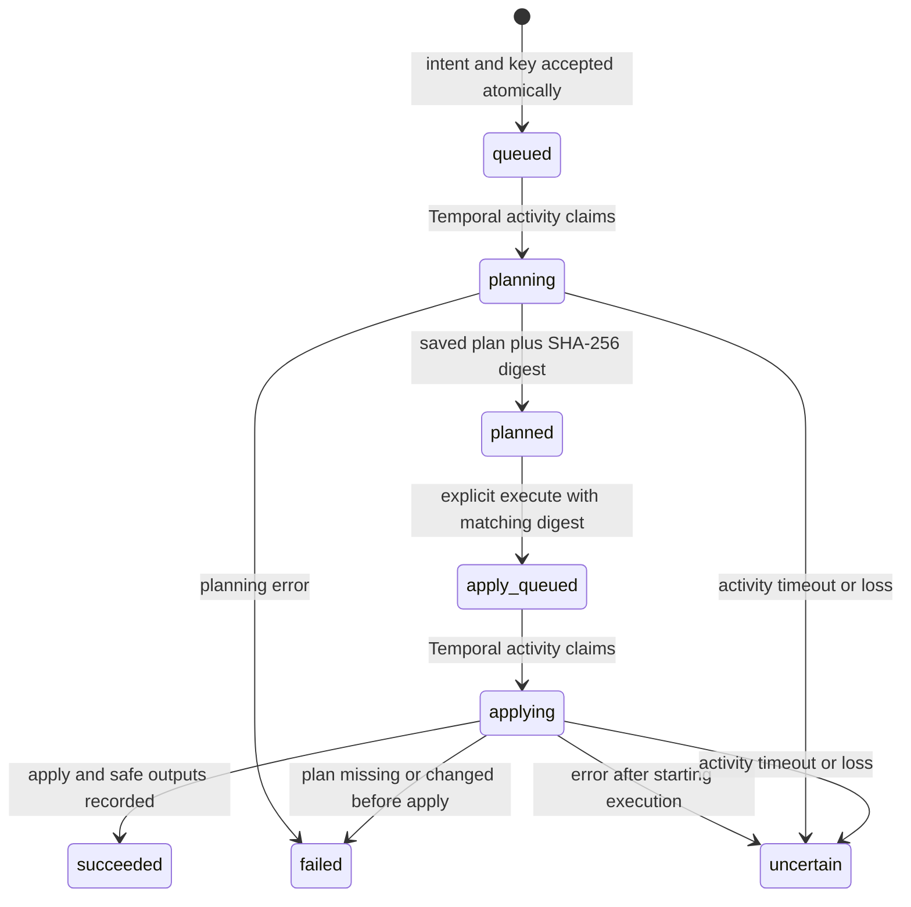

# Agent infrastructure architecture

Current as of: 2026-10-02, agent-v1 with Temporal; stable pagination, plan discard and bounded Terraform runs, plus local compatibility and recovery verification (unreleased).

The engineer requested a complete architecture replacement centered on AI agents and verified with Azure, AWS and GCP Floci. The engineer explicitly selected Temporal for asynchronous execution. The HTTP contract supersedes the old API plan; deterministic workflows and activities remain. It preserves the catalog, Terraform pattern boundary, tenant rules, identity choices and secret-output policy.

The work target is provisioning Azure, AWS and GCP resources. For simulation, `pve-desktop` hosts the API, Temporal and Floci in its existing Kubernetes guest; the user's desktop calls the API. This does not implement a home-lab infrastructure provider. See [the emulator deployment](../deploy/emulator/README.md).

## The agent's unit of work

An **intent** describes a permitted pattern, exact revision, placement and complete desired inputs. A **resource** identifies the Terraform state across operations. An **operation** binds an accepted intent to a saved Terraform plan and its outcome. An operation is not a conversation, and model-generated text is never executable policy.

Intent inputs reject non-finite numeric values before validation/acceptance, including nested
values; valid input representation and request fingerprints are preserved.

The API never runs Terraform. Worker activities execute validated pattern inputs. The agent chooses among platform-owned patterns and supplies validated inputs. Git tags resolve to commits at acceptance; `expected_commit` prevents a validation-to-submission tag change. API responses hide internal source locations, raw inputs, injected placement and subscription/account/project IDs.

## Lifecycle and retry semantics

`POST /operations` requires `Idempotency-Key`, scoped to the authenticated caller. The same key and canonical request return the same operation, even after a restart or moved git tag. Different requests with the same key receive 409. Replay is checked before catalog access and again inside the acceptance transaction.

Acceptance, the queued operation, resource reservation and `accepted` audit event share one transaction. After that commit, the API starts a Temporal phase workflow and returns `202` when dispatch is acknowledged. It waits for acceptance, not Terraform completion. Workflow IDs are `forgeapi-{operation_id}-plan` and `forgeapi-{operation_id}-apply`; reuse after completion is rejected and a running workflow is reused. Only operation IDs and phase names enter Temporal history. Execute is intrinsically idempotent by operation ID and digest. Concurrent execute calls queue only one apply. There are no automatic apply retries, force-unlock operations, or fallback replanning in the operation activities.

There is an explicit acceptance/dispatch boundary: no outbox is built. A crash before dispatch leaves the operation queued. A failed or lost dispatch acknowledgement returns `503 dispatch_unconfirmed`, the operation ID, status URL and `retry_same_request`. Retrying the same intent key/body or execution digest dispatches the same workflow. The accepted audit event stays accepted; transport uncertainty is not falsely recorded as a refusal. Without a client retry, work accepted before a dispatch failure can remain queued.

`tests/test_dispatch_crash.py` SIGKILLs a real local HTTP API at this boundary, then restarts
it with the same SQLite data and normal Temporal dispatch. The resource reservation survives;
no workflow starts until the identical request is retried. The retry returns the same operation
and resource, with one accepted event and one completed planning activity. The test stops before
apply and does not claim hosted recovery or automatic startup dispatch.

The SHA-256 digest covers the saved binary plan. The agent sees only addresses, resource types and action lists, not raw plan values. Missing or changed plans fail before apply. A stale Terraform state is handled conservatively: a failed apply becomes `uncertain`, even if the provider may have changed nothing. Interrupted planning is also conservatively uncertain. One unfinished or uncertain operation reserves a resource; additional intents receive 409.

`GET /resources` and `GET /resources/{id}` (capability `resource_inventory`) are the caller's inventory, with the same visibility rule as operations and an explicit field allowlist. State is `pending` (accepted, never successfully applied), `ready` or `destroyed`. Outputs, version and commit are those of the last successful apply; a `pending` resource shows the requested definition. `latest_operation_id` points at in-flight or most recent work. Pages are ordered by resource ID with an `after` cursor; follow `next_after` until null. A resource whose only plan failed or was discarded stays listed as `pending`. Optional `pattern`, `environment` and `state` filters (capability `resource_filters`) apply inside the visibility condition and compose with `after`; without a tenant mapping resources have no environment, so the environment filter matches nothing. Resources carry caller `labels` from deploy intents (capability `resource_labels`): kept when an update omits them, replaced when it sets them, refused on destroy, never passed to Terraform; a pending update shows the old labels until it succeeds. `label=key=value` filters inventory. `labels` is left out of the canonical intent when absent, so existing idempotency keys keep their fingerprints. `input_refs` (capability `input_references`) composes resources: each maps an input to a public output of a `ready` resource the caller may read, in the same business unit/environment under a tenant mapping; the value is copied into the operation's inputs at acceptance and validated like any input (so injected variables and region rules still apply, and a referenced `location` is not overridden by the unit's default region). Withheld outputs cannot be referenced. Refs are recorded on the resource; there is no live link. A destroy intent for a resource that another `ready` resource references is refused 409 `resource_referenced` (self-references and pending consumers do not count), and a source with an unfinished destroy cannot be referenced (capability `reference_protection`). Acceptance rechecks both rules inside its transaction, and execute refuses a deploy whose referenced source is destroyed or being destroyed (409 `reference_not_ready`), so a consumer planned before its source's destroy cannot apply afterwards. `GET /patterns` (capability `pattern_listing`) lists the caller's patterns with name, cloud and describe link from `patterns.yaml` alone, never contacting git.

An `uncertain` operation leaves through `POST /operations/{id}/reconcile` (capability `operator_reconciliation`) with `outcome` `succeeded` or `failed` and a `reason`. With a tenant mapping only members of its top-level `operators` groups may call it, for any business unit; without a mapping the creating caller may. It runs no Terraform: the operator inspects Terraform state and provider evidence first, and the call records that decision with an `operation.reconcile` audit event under the operator's identity and releases the reservation. `succeeded` requires an operation that reached apply and marks the resource `ready` or `destroyed` with no outputs, since the apply's outputs were never captured. The reason is stored on the operation and is not returned or put in audit events. Repeating the same outcome is a no-op; a different outcome is refused.

Operation listing filters by `resource_id` and `state` inside the same visibility condition; a `before` anchor outside the filter is a 404 like an invisible one. `GET /operations/{id}?wait=N` long-polls up to 30 s with async sleeps, so no worker thread is held. Each request gets an `X-Request-ID`, echoed in error bodies and in one `forgeapi.access` JSON log line that never contains tokens, bodies or query values. Temporal connections from the API, worker and readiness check go through one helper with optional TLS/mTLS.

Planned operations also carry `drift`: objects whose real state differed from Terraform state when the plan was made (Terraform's `resource_drift`, from the refresh every plan already does). A non-empty list means something changed outside the API; `changes` already account for it. To check an existing resource for drift, resubmit its current definition with a new key, inspect `drift` and `changes`, and discard the plan if no action is wanted. Older operations show `drift: null`. Drift entries pass the same placement-ID check as changes.

Each change also lists `changed_attributes` (dotted paths, at most three segments deep and 50 per resource), `replace_paths` and Terraform's `action_reason` for replacements, and `sensitive_attributes` (paths of changing sensitive values). Values are never stored or returned. Real Terraform reports a changed `local_file.content` as `["delete","create"]` with `replace_paths` `content` and `replace_because_cannot_update`.

**Guardrails** (capability `plan_guardrails`). A tenant environment may set `protected_resource_types` (a plan that deletes or replaces one of these Terraform types cannot execute) and `allow_destroy: false` (destroy intents are refused at submission, before any operation or reservation exists). Both refusals are 403 with reason `policy_denied` and next action `revise_intent`, plus a `refused` audit event. A denied plan stays `planned` and can be discarded. Without a tenant mapping, or if the environment is no longer in it, guardrails do not apply. Discovery shows them ahead of time: each business unit has `guardrails` keyed by deployable environment, with `allow_destroy` and sorted `protected_resource_types` (capability `guardrail_discovery`).

Every operation carries `change_summary`: counts of create, update, delete and replace plus `destructive` (any delete or replace), computed from the stored changes. Error bodies keep their frozen `code` and add an optional `reason` such as `resource_busy`, `plan_digest_mismatch`, `revision_moved` or `budget_exceeded`; `resource_busy` also returns the blocking operation's ID and status URL. Cloud-target conflicts have no reason yet.

A caller who rejects a reviewed plan uses `POST /operations/{id}/discard` (capability `discard_planned_operation`). Only `planned` can be discarded. V1 operation states are frozen, so the operation ends as `failed` with error `plan discarded before execution` and an `operation.discard` audit event; the resource is released and its budget reservation returns to the pre-acceptance amount. The saved plan file is deleted inside the discard transaction, while the resource is still reserved. Any operation that ends `failed` (planning error, plan missing/changed, stale plan, other Terraform version, held lock) also has its plan deleted before the reservation is released; an `uncertain` operation keeps its plan for the operator. A successful destroy deletes the workspace's `.terraform` directory; state, inputs and logs stay. Plans left by operations from before this change are not swept. Operations accepted before this change keep their reservation when discarded. With `FORGEAPI_PLAN_MAX_AGE_HOURS` set (capability `plan_expiry`), plans expire lazily, with no scheduler and no workflow change: execute of a `planned` operation older than the limit commits it as `failed` (`expired`, `operation.expire` event, plan deleted, reservation released) and then returns 409 `plan_expired`; a new intent whose resource is held only by an expired plan expires it in its acceptance transaction. Planned operations show `plan_expires_at` (from `planned_at`, or `updated_at` for older operations). Expired plans that nobody touches keep their reservation until touched. An apply that Terraform refuses before changing anything (stale saved plan, state lock held, plan made by another Terraform version) is also `failed` rather than `uncertain`; no unlock, retry or replan follows.

A digest binds bytes and is not an authorization credential. Execute always checks the caller's current tenant/environment permission. Cloud target and catalog cloud are rechecked against the accepted resource. Changed targets block execute/update/destroy. Other tenant settings are not all revalidated after planning; operators must suspend execution when changing placement policy and replan pending work. There is no automatic reconciliation endpoint in this milestone. An operator must inspect Terraform state and provider evidence before recovery is implemented or work resumed; editing audit events is never allowed.

## Policy and data

- Tenant mapping selects Azure subscription, AWS account guard or GCP project and a fixed region for cloud-declared patterns. Required target variables are injected and private. Legacy subscription-only mappings remain supported. The platform also determines permitted patterns, environment groups and sizes. Caller overrides of injected variables fail schema validation.
- Budget admission reserves the larger of previous and requested estimated cost until successful completion. Discovery shows each deployable budgeted environment's `monthly_budget`, `reserved` and `available` (capability `budget_discovery`), computed by the same helper admission uses; it is a snapshot, not a reservation. Reservations and admissions serialize in SQLite. Legacy committed costs in the same data directory are also counted; do not run simultaneous legacy mutations.
- Admission rejects invalid contributing stored estimates or aggregate overflow with sanitized 503 before acceptance; legacy rows remain read-only. Exact-key replay and destroy bypass new accounting checks. Validation-only does not scan operation-ledger reservations. Stored NULL counts as zero; no historical repair is performed.
- Existing JWT/Easy Auth parsing requires valid caller identities and relevant group claims. Malformed principals receive generic 401 before acceptance; valid identity selection and additive unknown claims remain supported. The shared fix also affects legacy authentication. Hosted identity integration remains unverified.
- Deploy/update/destroy use the same state identity. Destroy plans use the stored definition. Existing resources cannot switch patterns. They can switch versions: an update naming another version plans against existing state at the new commit (the worker refetches the workspace), and the reviewed plan is executed like any update. This needs state outside the workspace (azurerm backend, or a local backend path outside `work/`); a pattern whose `terraform.tfstate` lives in `work/` fails at planning with state untouched. Files a pattern writes under `work/` are lost on refetch. Unversioned local examples remain for developer verification only.
- Pattern declarations with caller-visible sensitive inputs are refused; use vault references. Sensitive outputs are removed before ledger persistence and their names reported as `withheld_outputs`. Outputs containing configured subscription/account/project IDs are also withheld.
- `GET /console` (capability `web_console`) is a static, same-origin web console over the existing endpoints; it adds no data routes, and its only mutations are execute (exact digest) and discard through the audited API.
- Failed and uncertain operations caused by a Terraform command carry `diagnostic` (capability `failure_diagnostics`): Terraform's first error with its command (`terraform plan failed: ...`), with placement IDs, GUIDs, 12-digit account numbers, URLs and `/subscriptions/` paths replaced by `[redacted]`, any credential/permission error replaced by a fixed sentence, and at most 400 characters. Other failures, successes and older operations have `null`.
- New plans fail before saving public changes/digests if the summary contains a known placement ID, including a Terraform instance key. Private placement and state remain intact and the unsafe plan file is deleted; historical summaries are not rewritten.
- Terraform and git child processes never inherit `FORGEAPI_*` variables, which is how the API's own secrets arrive. Other variables, including cloud provider settings, pass through. The git token is given only to `init`, the one command that fetches pattern modules. Settings read from a `.env` file were never in the process environment.
- With `FORGEAPI_AUTH_MODE=none` only loopback callers are served; others get 401 and a `refused` audit event on mutating routes. `FORGEAPI_ALLOW_UNAUTHENTICATED_REMOTE=true` is a lab-only override, set in `compose.yaml` and the emulator manifest.
- Raw Terraform plan JSON and provider/auth diagnostics are not persisted in activity logs. Command receipts contain command and exit code. Terraform's own state and binary plans may contain secrets and must remain on protected disk; they are never returned by the API.
- Audit is append-only, with database triggers refusing updates and deletes. Mutating request refusals are recorded without submitted values. Authenticated tenant visibility applies to operation lists, reads, execution and event pagination.
- Async exception handlers await synchronous refusal work in the existing threadpool. The refusal must persist before its response; storage failure remains sanitized 503. A real SQLite contention test proves health can respond while one refusal waits, without claiming capacity under threadpool saturation.

## Runtime and failure boundary

FastAPI and the Python Temporal worker share a local SQLite database and Terraform workspaces. There is no custom scheduler or polling loop. The API commits accepted work; Temporal runs a deterministic phase workflow; its activity claims only that operation and phase. The worker supports four concurrent activities. Both planning and applying use `maximum_attempts=1`. Only the idempotent timeout-status activity may retry.

Queued activities wait for a worker, including across worker restarts. Saved plans remain on durable disk while the caller inspects them. The plan and apply workflows are separate, allowing explicit execution without a long-running approval workflow. A crashed activity is not retried: after the 10-minute plan or 30-minute apply timeout, the workflow records `uncertain` when a worker is available. Late results cannot overwrite that status. Inside those timeouts each phase has a Terraform deadline (8 and 28 minutes): the worker sends SIGINT to the Terraform process group, waits 60 seconds, then SIGKILLs it. A plan deadline is `failed`; an apply deadline is `uncertain`. A dead worker cannot kill its child. Only `init` takes the provider-cache lock, so a long apply does not delay other resources' plans. Uncertain work retains its resource reservation and requires operator reconciliation. There is no startup-wide scan that marks other workers' running activities interrupted.

`tests/test_worker_interruption.py` verifies actual worker SIGKILL during a gated, local-only
Terraform apply and a separate surviving-worker late completion. Temporal history proves an
activity timeout; command receipts prove one plan/apply. Replacement work is refused and a late
success write cannot clear uncertainty or append a success event. A test-only interceptor checks
the production 30-minute apply timeout and shortens it to five seconds. This is accelerated
timeout evidence with real processes and activities, not a 30-minute wall-clock or hosted-cloud
test. Continued local-exec after worker death does not establish successful Terraform state commit.

The native dev server and packaged engine persist Temporal history in `DATA_DIR/temporal.db`. They are development servers, not production Temporal services. An existing Temporal service can be selected with the address/namespace/task-queue settings. Losing history must be handled as an operational incident; the ledger still prevents rerunning a claimed phase, but does not reconstruct workflow history.

Backups require a quiesced point across the ledger, Temporal history and Terraform artifacts.
Stop admissions and every writer, including surviving Terraform children, before copying the
complete protected data directory. Restore with original writers stopped and the same absolute
paths, configuration and compatible toolchain. An older snapshot can omit later execution
records; reconcile any post-snapshot execution or provider changes before resuming. The local
directory does not contain external Temporal or cloud/emulator state.

`tests/test_backup_restore.py` proves a stopped whole-tree restore at the original paths with
the same configuration/toolchain and no post-snapshot changes. Fresh Temporal and worker
instances retain completed workflow identities/results, ledger/audit and the pending plan
digest, then execute that exact plan once without replanning. It uses a local-file resource
inside the backed-up directory; external resource recovery remains unverified.

Public Terraform outputs must serialize as strict JSON after sensitive and placement-ID
filtering. If an oversized number decodes to infinity, publication fails through the existing
uncertain execution path: keep the reservation and reconcile with an operator; never reapply
automatically. Sensitive outputs are withheld before this check. Finite values and exact large integers remain
valid; overflowing command-output responses are a fault-injection boundary, not an observed
normal Terraform output behavior.

Ordinary operation/resource/replay/list/event reads use deferred SQLite transactions;
mutations retain `BEGIN IMMEDIATE`. This lets readers observe committed data while another
connection holds a reserved write lock. Cursor-anchor and page reads share one transaction.
It does not promise nonblocking reads under exclusive locks or during first-time schema/index
creation, and does not change journal mode or single-host storage requirements.

This is a single-host implementation. SQLite on network shares and independent stateless replicas are unsupported. The former Table Storage backend explicitly fails for operations. Distributed hosting would need a transactional ledger with resource fencing and durable plan storage; that is the next architecture milestone, not a claimed current feature.

The HTTP API starts with `uv` alone. Accepting work needs a reachable Temporal service; executing patterns additionally needs a worker, Terraform and git. Agents call the HTTP API using the existing short-lived caller bearer-token authentication. They do not receive cloud executor credentials. There is no MCP server. No LLM SDK, API key or server-side model is needed.

`app.client.Client` and `python -m app.client` provide a thin consumer of that HTTP boundary.
They discover the contract and links, validate and submit caller-owned intents with explicit
keys, list or inspect operations/events, and execute only an explicitly supplied reviewed plan digest.
Each command is one step. The caller retains request identity and controls polling and retry;
the client never makes autonomous infrastructure decisions. Transport failures after mutation
are ambiguous, and `dispatch_unconfirmed` preserves the server's safe operation identity.
Unknown execution instructions or inconsistent operation identity stop execution. The client
accepts HTTPS or loopback HTTP, follows only same-origin links, refuses redirects, and uses
runtime bearer tokens without storing credentials. No server settings or endpoints are added.
Operation listing fetches one explicit page, preserves response fields and validates every item.
Cursor mode requires the stable-pagination capability; baseline listing remains available on
older discovery without it. There is no automatic traversal or cursor-to-offset fallback.
The client rejects duplicate operation IDs, a returned cursor anchor, and continuation values
that do not match the returned page. Older pages without `next_before` and additive response
fields remain supported. This checks one page; it does not prove a complete snapshot.
Read-only status/list/event calls were verified against the retained older hosted runtime on
2026-10-02 with all version/capability metadata absent; no hosted mutation or upgrade occurred.
Event pages support explicit `--after` and `--limit`; follow `next_after` until null. The
client checks event operation identity and ascending sequence, preserves additive fields and
unknown action/outcome strings, and fetches one page at a time.

## Verified cloud boundary

`tests/test_floci.py` exercises the real Temporal server, worker and Terraform through the HTTP ASGI application. It verifies S3 bucket lifecycle against Floci AWS 2.1.0, resource-group and tenant-placed Storage account/blob container lifecycle against Floci Azure 0.13.0, and GCS bucket lifecycle against Floci GCP 0.9.0 (Google provider 7.36.0). Each fixture is a temporary git repo/tag, resolved and pinned through the real catalog. Separate HTTP reads verify absence before execution, presence after apply and absence after destroy.

Azure's provider uses Floci's HTTPS metadata discovery and emulated MSI endpoint. The test downloads the ephemeral emulator CA into a temporary trust bundle. AWS dummy credentials and the explicit Google access token are emulator-only. Storage tests route Azure domain-based HTTP endpoints through a loopback emulator-only router. The placed AWS fixture checks its account with STS and `allowed_account_ids`; a mismatched account is tested to fail before creation. Provider versions and emulator image digests are pinned. The emulators receive no Docker socket, cloud credentials or host state volumes.

Sources for emulator setup: [Floci AWS](https://github.com/floci-io/floci), [Floci Azure Terraform guide](https://floci.io/floci-az/terraform/), [Floci GCP Terraform fixtures](https://github.com/floci-io/floci-gcp/tree/main/compatibility-tests/compat-terraform). Emulator success does not prove real-cloud IAM, Azure RBAC, billing, regional capacity, private networking or provider parity.

`tests/test_floci_features.py` (also `--floci`) proves the newer features on the same real
stack against Floci AWS: output references with destroy protection, labels and inventory
filters, a version upgrade with S3 remote state held in Floci, discard and plan expiry deleting
the saved plan before anything is created, and failed-plan cleanup.
`tests/test_floci_placed_features.py` adds tenant placement on AWS, Azure and GCP: discovery
guardrails/budgets without placement IDs, budget enforcement matching `available`, labels and
filters, cross-environment ref refusal, protected-type and no-destroy refusals, and accept-path
plan expiry with a single budget reservation.

## Compatibility and migration

The operation API's canonical routes start with `/v1`; the original root routes remain v1
aliases sharing handlers, caller/key scope and the ledger. Prefix-aware links and status URLs
keep each client in its requested route family. The canonical schema is `/v1/openapi.json`;
`/openapi.json` retains the existing route surface. Health stays at `/healthz`.

Operation listing supports optional `before=<operation_id>` traversal under discovery capability
`stable_operation_pagination`. Anchor and page lookup use the same visibility filter; missing
and invisible anchors share 404. The nullable `next_before` guides continuation, while existing
offset clients retain their behavior. New arrivals cannot shift cursor pages; states remain
live. Operation offsets and event sequence positions are bounded to SQLite signed integers;
oversized values receive structured 422 before database access. This adds no cursor store,
endpoint or database migration.

[The compatibility policy](api-versioning.md) separates the HTTP major, application release
and pattern revision. V1 preserves field/default/error and execution behavior; clients ignore
extra response fields but require advertised capabilities for optional features. Unknown
requests remain rejected and unknown execution instructions require a safe stop. Canonical
request fingerprints preserve the original default-expanded intent representation, so route
aliases and releases do not invalidate accepted requests. Contract snapshots, historical
ledger/plan checks guard evolution. `tests/test_workflow_replay.py` replays captured plan,
successful apply and controlled activity-failure histories with normal timeout/retry settings.
The successful apply used real local Terraform; a test-only failing activity exercises the real
workflow's uncertainty writer. These are current baselines, not pre-versioning, released older
worker or actual-timeout histories. Broader changes require coverage of their affected paths.
These checks do not authorize arbitrary database migrations, mixed-version workers or downgrades.
Legacy API compatibility is separate.

`app.main:app` now serves agent-v1. `/deployments` is retained in `app.legacy:app`, with its documentation under `docs/archive-temporal/`. Old regression tests explicitly target that module. The worker registers both new operation workflows and retained legacy workflow types. The default image includes Temporal; compose runs API and engine roles sharing local disk.

The new ledger is `operations.sqlite`; old deployment databases and Terraform state are left in place. New resource IDs start with `res_`, operation IDs with `op_`, and old deployment IDs with `dep_`. No existing deployment is silently imported. Continue using the old released version for existing hosted deployments until an explicit state/ownership migration is designed and verified.

When switching from the unreleased controller prototype, stop it before starting Temporal workers. Existing queued operations need a retry of the original request to dispatch; planned operations retain their digest. Inspect any running/uncertain operation before migration. Never run both schedulers against the same data. Rolling back code requires stopping the new worker first and preserving both databases and all plans; it cannot undo completed cloud changes. No automatic migration or rollback of live state is performed.
