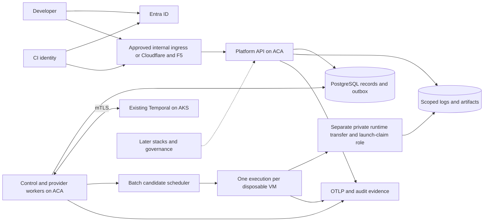

# 1. Executive summary and context

**Status:** proposed M0 design. [Index](README.md).

**Implementation update, 2026-09-07:** local-first core is built with mandatory Entra and Docker Compose; compute remains synthetic. The separately authorized retained Key Vault and native certificate executor are a bounded exception to the original sequence, recorded in [ADR-0013](../adr/0013-local-terraform-lab-exception.md). The hosted/Batch diagram and milestone table below are the target architecture, not current deployment inventory. Full M1 acceptance remains open; see [evidence status](12-verification.md#current-evidence-overlay).

The product is an internal Infrastructure Platform API for roughly 100 developers and their CI pipelines. The first supported operation is an isolated, temporary OCI execution. Later persistent stacks share identity, authorization, policy, durable dispatch, artifacts, and audit, while retaining a different lifecycle and state model.

Recommend Go with chi, two independently deployable process types from one monorepo, PostgreSQL records/outbox, and Temporal orchestration. Host API and workers on VNet-integrated ACA; connect to the existing enterprise Temporal service on AKS through its approved mTLS pattern. The API does not run on that AKS cluster. Azure Batch is a candidate workload scheduler until experiments establish viability.

The worker process has deployment roles for lifecycle/control work and target-scoped provider activities. Initially the fake can share one worker deployment. Live provisioning uses a separately assigned worker identity. This is a process/permission boundary within one application, not a new independently operated service for each domain concept.

## Delivery boundaries

| Stage | Outcome | Explicit limit |
| --- | --- | --- |
| M0 now | Reviewable contracts, ADRs, threat model, experiments, and traceability | Design approval remains pending |
| M1 after approval | Entra-scoped request → committed admission/outbox → Temporal → fake → results/cleanup → evidence | No cloud isolation or billing claim |
| M2 separately approved | Minimal foundations and exact workload experiments | Decide Batch versus direct VMSS before full adapter |
| M3 separately approved | Selected Azure adapter and security/failure/demo acceptance | Controlled POC, not production readiness |
| M4–M6 roadmap | Persistent stacks, pricing/governance, promotion/drift/showback | Enable only when the controls each use requires exist |

Keep one representative template and a minimal curl flow. Do not introduce AWS/GCP code, a plugin runtime, a universal catalog, a custom token issuer, per-execution Terraform, or placeholder future API routes. The resource-group example can wait until the persistent-stack milestone.

## Reconciliation of the source documents

| Source tension | Resolution for this design |
| --- | --- |
| Source Temporal hosting TBD | Existing self-hosted AKS service is a supplied fact; access and authorization are unverified |
| “First technical gate” versus source Phase 3 | Batch is the first **live compute** decision gate, after the shared M1 foundation |
| Persistent stacks versus disposable workloads | Separate aggregates and provider contracts; shared application services |
| “No long-lived shared credentials” versus earlier absolute API-key ban | Original target policy: no runtime API keys, client secrets or PATs. The later seven-day home-lab executor certificate is a separately approved exception in ADR-0013, not a hosted/work default |
| “Build or pull” versus immutable-image admission | Proposed demo pulls an admitted entrypoint and pinned helper images; source-image builds are disabled in this template pending a separate admitted build policy |
| Docker access versus host/identity isolation | Recommend trusted supervisor-run Compose with no untrusted Docker API; confirm representative features and prove launch/identity boundary in M2 |
| Newly allocated versus reimaged workers | Fresh single-use VM, then removal; no reuse/reimage acceptance assumed |
| Cloudflare/F5 versus internal demo | Recommend internal-only POC ingress if networking owner permits it; API authorization applies to both |
| Numeric performance targets absent | Record measurements with cold/warm cohort and sample count; agree targets before deciding pass/fail |
| Zalando conventions versus example lowercase states / async execution | Document proposed local decisions and deviations in section 4; internal guideline approval is outstanding |

## Main recommendations for review

Accept the execution resource as its own operation/status resource. Persist acceptance before responding; dispatch through an outbox. A terminal workload result does not imply successful cleanup or artifact delivery. Never let uncertainty after an external submission become permission to submit new work.

Use a dedicated single-node Batch pool per execution for the first live experiment. This favors an auditable no-reuse boundary; its latency and quota cost may make it unsuitable. A direct VMSS fallback carries greater controller responsibilities and does not automatically resolve Docker privilege risks.

Security and data owners must decide workload classification, exact Docker requirements, execution-scoped access, and accepted evidence before live untrusted execution. Provisional defaults make this package reviewable without asserting those organizational decisions have already been made.
