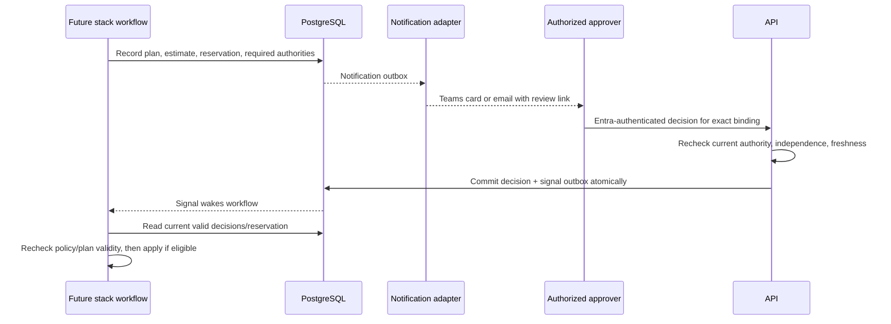
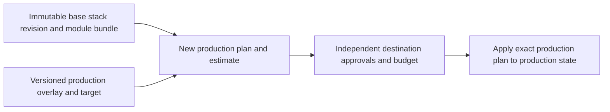

# 8. Cost, budgets, and approval design

**Status:** proposed. POC limits/measurements now in design; full governance is later. [Index](README.md).

**Current boundary:** no pricing service, budget ledger, manager lookup, notifications or independent approval service is implemented. The separately authorized empty-vault spike uses same-owner saved-plan approval and no data-plane operations; it neither proves zero subscription cost nor implements these future governance controls. [Lab exception](../adr/0013-local-terraform-lab-exception.md). No paid experiment is authorized.

## M1–M3 scope

Bound admission by finite approved profiles, active concurrency, accepted-to-finish timeout, independently enforced maximum resource lifetime, storage/output limits and an agreed experiment spend ceiling. Reserve concurrency transactionally so simultaneous submissions cannot exceed the configured allowance. Unknown cleanup retains capacity/accounting exposure until reconciled. A cap on requested compute is not a guarantee Azure charges cannot exceed a monetary number during failures.

For every live execution record provisioned VM size internally, region/rate basis, allocation-to-removal time, workload duration, storage/transfer consumption and shared/idle cost allocation assumptions. Return safe normalized usage/results; keep provider rate metadata in operator/FinOps evidence. Report per-execution estimate and observed usage with currency/date/coverage, then compare billing actuals when available. Fake usage is synthetic and never presented as Azure cost. No Infracost dependency blocks M1.

Do not count a disposable VM as a month-long VM unless modeling explicitly retained warm capacity. Separate execution marginal cost from shared control-plane/image/network costs and any unused warm-node cost. Agree granularity and spend thresholds in V11 before a paid experiment.

M2's spend control is a small experiment register, not the later product budget ledger. Before allocation, atomically reserve a conservative bound from remaining approved experiment headroom: planned maximum VM lifetime (including allocation/idle/cleanup), approved rate snapshot and capped storage/transfer, plus the approved share of foundation costs. Count active, deleting, failed and unknown-presence resources until reconciled; manual experiment allocations use the same register. Update estimated accrued usage at the approved sweep cadence and reconcile delayed billing without double-counting intervals. Missing/stale rates, limits, inventory or monitor heartbeat block new allocation. Exhausted headroom stops admission, alerts the named operator and requests bounded termination/cleanup of experiment capacity according to the preapproved stop policy. Azure budget alerts supplement this control; they are not an automatic hard spend stop. Resuming or increasing the ceiling needs a new manager/FinOps authorization, not an operator bypass. V11 tests concurrent reservations, stale observation and cost of failed cleanup using synthetic rates before the first paid run.

## Future estimate and negotiated-rate evaluation

Each provisioning operation must produce an asynchronous estimate outcome: `complete`, `partial`, `unavailable`, or `known_zero`. Preserve uncertainty; only evidence of no applicable charge supports zero. Include resulting monthly run rate, incremental run rate versus the current deployment and prorated current-period impact, plus basis/currency/units/usage assumptions/exclusions/coverage/effective period/rate and estimator versions.

| Concern | Proposed evaluation | Required evidence |
| --- | --- | --- |
| Resource/usage estimator | Evaluate Infracost on representative approved modules | Exact CLI/plan JSON/resource support and coverage |
| Negotiated rates | Approved Azure EA/MCA price-sheet export | Billing-scope authorization independent of subscription access; effective-date/currency provenance |
| Applying negotiated rates | Evaluate supported Infracost custom price books first | SKU/meter/region/unit/tier matching, updates and auditability; not merely a flat discount |
| Deployment/authentication | Hosted or vendor-supported self-hosted edition if policy-compatible | Licensing, short-lived/federated authentication, feature parity, operational support and egress |

Infracost documents Azure custom price-sheet ingestion and service/region/SKU pricing options. Its management API currently requires a service-account token distinct from its CLI token. That is an unresolved conflict with the runtime credential policy, not permission to store a SaaS key in Key Vault. [Custom price books](https://www.infracost.io/docs/infracost_cloud/custom_price_books/), [Management API](https://www.infracost.io/docs/infracost_cloud/api/).

Test mapping against representative compute/storage/network/database resources, reservations/savings commitments, billing tiers, discounts, unsupported charges and changing rate periods. Keep AWS/GCP pricing ports later, without promising equivalent meter/commitment semantics. Vendor confirmation is required for self-hosted licensing/authentication and custom-price-book support; an old public pricing-server repository is not evidence of current product parity.

The documented Cloud Pricing API receives extracted price-lookup parameters rather than the complete plan JSON; optional cloud dashboards store estimates/issues. Inspect actual version/configuration/network traffic, including telemetry and exports, before claiming no egress. Do not generalize documentation into a configuration-specific guarantee. [Infracost FAQ](https://www.infracost.io/docs/faq/).

Compliant fallback: keep M1–M3 measurements local using approved rate snapshots; for broader stack use, prefer an approved estimator/feed integration or a scoped manual FinOps review with bound evidence while vendor authentication is unresolved. Do not expose cost-gated apply without an operational gate. A credential exception is an explicit organizational decision, not an implementation shortcut.

## Future budget ledger

Track independent BU/team/request policies in PostgreSQL. Ledger entries are append-only facts and compensating adjustments; reservations have unique operation/plan IDs, target/period/currency, lifecycle and expiry. Lock all applicable budget rows in stable order and atomically check/reserve across scopes, preventing two concurrent requests from using the same headroom. New plans replace reservations transactionally; retries deduplicate by operation and plan digest.

For each resource/time interval, count exactly one base usage exposure:

```text
projected period exposure = reported actuals through billing watermark
                         + estimated elapsed usage not yet reported
                         + remaining-period forecast for retained resources
                         + incremental pending reservations not in those terms
```

Reconcile corrected actuals with compensating entries and replace elapsed estimates only for matched intervals/resources. A late bill must not be added while leaving its overlapping estimate. Track actual and amortized commitment views separately; document which the policy uses. Carry retained-resource forecasts across month rollover and split multi-period reservations; do not release exposure for uncertain partial applies or failed cleanup. Destroy/cancel releases only what no longer exists/was never allocated. [Azure cost data timing and attribution](https://learn.microsoft.com/en-us/azure/cost-management-billing/costs/understand-cost-mgt-data).

On confirmed apply, convert the matching pending reservation into elapsed estimate plus remaining-period resource forecast atomically; uncertain/partial apply retains its unmatched exposure until reconciled. A cross-BU target permit records the charged BU/cost center and budget-owner authority explicitly. Default charge follows the requesting application's registered BU; a different charged owner requires that owner's approval and binding before reservation, not attribution inferred from subscription location.

Authorization/security denials are nonoverridable by cost approval. Define overridable request thresholds versus BU caps, emergency changes and cost-reducing actions with named authority. A budget gate reduces oversubscription risk; provider delays, uncertain resources and delayed actuals mean it is not an absolute spend stop.

## Future decisions and notifications

Request-level exceptions route to the human manager or registered CI sponsor. BU-cap exceptions require BU budget-owner/delegate authority. Manager status does not imply budget-owner status. Promotion to production defaults to an independent app owner, plus platform/change-board review for declared higher-risk classes. App/BU configuration may strengthen these rules.

Graph v1.0 List manager currently documents delegated `User.Read.All` and no application-permission support. Do not assume a managed identity can make that background query. Recommended fallback is an approved synchronized directory relationship feed with freshness/provenance, plus a governed sponsor registry for CI and missing managers. Verify the actual tenant query and consent before selecting a path. [Graph List manager](https://learn.microsoft.com/en-us/graph/api/user-list-manager?view=graph-rest-1.0).

Resolve absent/stale managers to a documented escalation, never auto-approve. Delegations include scope, period, reason, delegator authority and revocation. Reject self-approval; expiry/rejection/revocation ends eligibility. Notification retries do not extend approval/plan validity. Teams cards and email link to the API-authenticated decision flow; no anonymous webhook/card token may approve.





Both diagrams are future flows. Pricing, directory, notification and approval services are introduced only when their milestone requires them, not as unused M1 frameworks.
