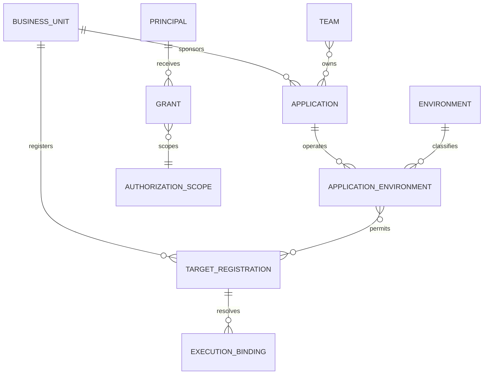

# 10. BU/subscription registry and ADRs

**Status:** proposed. [Index](README.md).

**Implementation boundary:** current local grants are a bounded principal/application/environment model, not this complete BU/team/classification registry. The lab deployment target is one ignored server-owned binding, not a multi-target registry. Its vault/UAMI/SP do not establish the enterprise topology below. [ADR-0013](../adr/0013-local-terraform-lab-exception.md) records the exception and evidence.

## Registration model

Do not equate a BU with one subscription, one application or one environment. Model registrations as explicit relationships and versioned deployment targets.

`AUTHORIZATION_SCOPE` is a typed reference, not an unrestricted string. Scope kinds are `business_unit`, `team`, `application`, `application_environment`, `target_registration`, and `catalog`; audit grants use one of those registered ownership/target scopes rather than a second undefined hierarchy.

## Grant evaluation and target selection

Each grant records permission, `scope_kind/scope_id`, validity, provenance, approved classifications and subject restriction (`own_submissions` or explicit scope-wide access). The registry validates the target kind and existence before publication. Scope-specific foreign-key tables or a constrained scope registry must preserve that integrity in SQL; do not implement an unchecked polymorphic ID.

Ownership scopes expand through current registered BU/team/application/environment relationships. Grants union only for the same permission; each required operation permission must independently match the object/context and all of that grant's restrictions. An execution read grant does not imply data read, cancellation or input consumption. Target grants authorize operations on that registered target, not every application's workload data; catalog grants authorize only the assigned catalog, while app/environment `catalog.read` filters to templates eligible there. Suspension, revocation, classification policy and token restrictions intersect with grants and deny regardless of a broader allow. Missing/expired memberships fail closed. Audit permission never implies raw data access.

For each app/environment/capability/profile, recommend exactly one eligible `primary` target. Alternative target bindings are `draining` (existing work only) or `migration_candidate` (not admitted). Admission must find exactly one enabled primary satisfying residency, capability and environment policy; zero yields sanitized `policy_denied`, more than one yields service configuration error/503 and operator evidence, never random selection or implicit failover. Pin the selected registration version. Changing a primary requires reviewed migration; in-flight work keeps its original target and cleanup authority. This rule is defined before M1 registry migrations even though live multi-target migration is later.

| Registry field group | Required contents |
| --- | --- |
| Ownership | BU/team/app IDs, cost center, owner contacts, CI sponsor, effective dates, authoritative source |
| Environment relationship | Production/nonproduction classification, allowed app/environment pairs, explicit owner grants |
| Cloud target, internal only | Tenant/subscription/resource group/billing scopes, approved regions, quota/capacity prerequisites |
| Runtime isolation | Allowed capabilities/profiles, provider selection, namespace/worker pool/identity, network pattern, image baseline |
| Data scope | State/artifact containers and policies, allowed classifications/residency, vault policy references, retention |
| Governance | Versioned policy set, FinOps/budget owners, current availability, evidence references, expiry/revalidation |

Registration has `draft → verified → enabled → suspended → retired` administration states, separate from execution lifecycle. Enable only after owner/security/network/quota evidence is recorded. Admission pins the registration version; current suspension/revocation can deny dispatch without rewriting historical evidence. Operators cannot add arbitrary targets through execution request tags.

Recommend separate production and nonproduction subscriptions per BU as the starting policy for **new registered targets**. Current BU subscriptions hosting multiple apps remain a supplied fact. Do not claim separation already exists. Record their actual environment use, restrict the POC to an approved nonproduction scope and plan target-by-target migration with platform owners. Existing deployments retain their state/resource ownership; changing a registry target does not move Azure resources. New target enablement, identity/data/network setup, workload cutover and old-target retirement require separate migration evidence.

Application Key Vault recommendation: separate application/region/environment vault boundaries, plus a separate platform vault for Temporal certificates and platform configuration. Each application uses its own identity. Per-BU shared vault is an alternative only after demonstrating equivalent access isolation and operational ownership; no single provider identity reads all application vaults. Application vault topology remains an organizational decision in V06/V10. [Key Vault security guidance](https://learn.microsoft.com/en-us/azure/key-vault/general/secure-key-vault).

Future stack tags derive from registry before apply: `bu`, `app`, `env`, `owner`, `stack-id`, `cost-center`. Maintain exceptions for untaggable resources and a durable resource-ID ownership ledger for cost attribution. Execution/request correlation remains audit metadata; avoid rewriting persistent resource tags on every operation. Tags never establish authorization or state ownership.

## ADR index

All ADRs are **Proposed**, including choices strongly directed by the prompt. No reviewer's acceptance is invented.

| ADR | Decision under review | Verification dependencies | Proposed review treatment / recorded decision |
| --- | --- | --- | --- |
| [0001](../adr/0001-modular-platform.md) | Modular Go/chi; separately privileged public/runtime/worker roles | V02–V04/V14/V15/V20 | M1 application shape, M2 hosting condition; **Pending** |
| [0002](../adr/0002-execution-api-contract.md) | Execution operation, defaults/idempotency/status/cursor conventions | V01, F01/F14/S02 | Decide before contract freeze; **Pending** |
| [0003](../adr/0003-durable-dispatch-reconciliation.md) | Outbox/attempts/fences, bounded cancellation and ticket-only recovery | V04/V13, F01/F03/F11/F13–F18 | M1 core; restore evidence M3; **Pending** |
| [0004](../adr/0004-compute-controller-isolation.md) | Supervisor-run Compose proposal, one-use VM and Batch experiment | V05–V11, F03/F08–F12/F15, S03–S09 | Approve experiment scope separately; defer live-provider acceptance; **Pending** |
| [0005](../adr/0005-identity-authorization.md) | Complete grants and separate caller/control/runtime/workload identity | V02/V03/V05/V06/V10/V16, S01–S05/S11 | M1 permission contract; live identity proof M2; **Pending** |
| [0006](../adr/0006-policy-engine.md) | Go rules behind narrow PolicyEngine port | V01/V09, policy fixtures | M1 deterministic policy direction; **Pending** |
| [0007](../adr/0007-terraform-ownership.md) | M2 foundation/revision single writer; separate later stack executor | V05/V14/V15/V19 | M2 foundations; defer M4 executor acceptance; **Pending** |
| [0008](../adr/0008-temporal-workers-rollout.md) | Short activities/history/replay and hosted shutdown | V03/V04/V15; optional scaler V22 | M1 lifecycle/replay; hosting proof M2; **Pending** |
| [0009](../adr/0009-data-audit-recovery.md) | Data/lease/telemetry trust and cross-store recovery | V10/V12/V13, F16/F17/S07/S10 | M1 data model; live retention/recovery owner conditions; **Pending** |
| [0010](../adr/0010-targets-and-vaults.md) | Typed grants/primary target, migration and app vault boundaries | V05/V06/V10 | M1 registry model; defer actual target/vault approval to owners; **Pending** |
| [0011](../adr/0011-future-pricing-governance.md) | M2 experiment ceiling; later budget/pricing/approval model | V11/V17–V19 | M2 limits; defer M4+ feature acceptance; **Pending** |
| [0012](../adr/0012-engineering-working-agreement.md) | Requested collaboration/tests; optional agents | V01/V04/V20; optional agents V21 | Required M1 task/test agreement; agents separate; **Pending** |
| [0013](../adr/0013-local-terraform-lab-exception.md) | Local-first core, completed single-vault spike and approved short-lived executor certificate | Scoped lab evidence in progress; enterprise V03/V06/V19 remain open | Engineer authorized the operations; ADR review and broader architecture acceptance **Pending** |

When accepting an ADR, record both engineers' decision/date and conditions, and link the package revision. A conditional ADR cannot turn an unrun security experiment into acceptance. Supersede ADRs with evidence rather than silently rewriting accepted history.

Replace Pending with the human-recorded `accept`, `conditional` (explicit condition/gate), or `defer` plus names/date/revision and evidence link. Proposed review treatment is guidance, not that decision. Accepting one bounded milestone does not accept all later features in an ADR.
