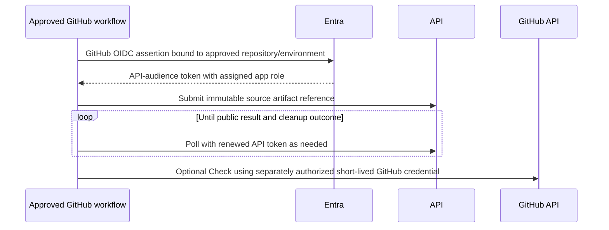

# 2. Architecture and trust boundaries

**Status:** proposed. [Index](README.md). Detailed domain and persistence rules: [section 3](03-domain.md), [section 5](05-temporal-recovery.md).

## Component and data ownership

| Component | Authority | Boundary |
| --- | --- | --- |
| HTTP API | Caller authentication, object authorization, validation/admission, public representation | Cannot provision compute; does not trust caller-selected ownership |
| PostgreSQL | Accepted intent, registries, immutable resolved specs, idempotency, cancellation intent, attempts, public projections | A projection is not proof of provider absence |
| Outbox dispatcher in control worker | Delivery of persisted start/signal/audit intent | No new admission decisions; stable deduplication IDs |
| Temporal workflow | Lifecycle decisions, timers, retry coordination, cleanup progression | References only; no Azure SDK or network I/O in workflow code |
| Provider activity deployment | Approved target's provider operations and normalization | Internal target binding; does not accept arbitrary subscription/queue arguments |
| Batch | Actual pool, job, task, node lifecycle and capacity | Only Batch APIs mutate its fleet |
| Artifact services | Scoped transfer, manifests, digest verification, publication | API authorization before any caller read; input and output privileges differ |
| Immutable audit store + searchable index | Retained sanitized evidence and search | Database/Git alone do not prove immutability |
| Provider reconciler | Compare durable intent/attempts with actual resources | May recover/clean known work; cannot invent a new execution |

The private runtime interface reuses the HTTP binary/modules but runs in a separately deployed `runtime` role, with its own managed identity, DB role, authentication audience and private ingress. Listener separation alone is not a privilege boundary. M2.1 builds its minimal assignment/launch-claim/input-output path before any untrusted Batch experiment; M3 integrates full live transfer and any separately approved secret path. The public API never inherits upload, launch-claim or application-secret authority. Runtime notifications do not advance authoritative lifecycle state without inspection.

Process glossary: dispatcher and admission reconciler run in the control-worker role; the sweeper is the target-scoped provider-worker ticket loop. The supervisor is trusted code on the disposable VM, not a Temporal worker. The runtime transfer/claim service is the private HTTP role; a Docker API broker would be a different optional on-VM component, not the secret broker. These are deployment roles in one monorepo, not independent domain services.

## Identities and minimum access

Concrete principal IDs, custom-role actions, certificate identities, and assignment scopes are deployment evidence required by V02/V03/V06, not invented here.

| Identity | Allowed access | Explicit exclusions / scope |
| --- | --- | --- |
| Human | API delegated scope plus registry permission on application/environment | No production Temporal client or provider credentials |
| CI application | API app roles; registry-bound app/environment and registered sponsor | No trust from repository-name claims alone; no shared secret |
| Trusted input publisher/importer | `artifact.publish` in registered app/environment; scoped staging writes and constrained verification/publication procedures | No provider mutation, unrelated input listing or execution-output overwrite; distinct from ordinary submitter |
| API managed identity | Restricted PostgreSQL API role; caller-authorized artifact reads; its certificate/config references if needed | No Batch/Compute create/update/delete, RBAC assignment, state access, or all-app vault access |
| Control worker managed identity | Lifecycle DB role, outbox and audit append; its Temporal certificate | No cloud fleet write rights |
| Provider worker managed identity | Batch management-plane pool read/write/delete at the approved account; approved job/task data-plane operations; `Microsoft.ManagedIdentity/userAssignedIdentities/assign/action` on the finite pre-created execution identities; scoped manifest operations and its own Temporal credential | No underlying Compute fleet mutation, identity creation, arbitrary identity assignment, other BU targets or general RBAC role assignment; V05 validates exact action allowlist |
| Batch service identity / service principal | Documented allocation-mode permissions approved by platform team | Different from caller and activity identity; permission set reviewed independently |
| Bootstrap/node identity | Pull approved registry repositories and obtain only that execution's assignment | Never provider control-plane identity; token/cache/file exposure tested against actual Docker authority |
| Workload identity / access session | Read only assigned input objects, append assigned outputs, use explicitly admitted secret policies | No object listing across executions, deletion of evidence, platform vault, registry write, or direct Temporal access |
| Runtime transfer/claim role | Assignment-scoped input reads/staging writes, constrained DB launch-claim/manifest procedures; no caller admission or lifecycle writes | Separate deployment/identity from public API starting M2.1; no application vault access for secret-free demo |
| Optional application-secret delivery role | Read only admitted secret versions in one application's region/environment vault; verify execution/policy before delivery | Separate identity/deployment per app boundary if enabled; no all-app-vault role or cloud-control rights |
| Image-build/publish CI | Approved registry/Gallery writes via federation; scanning/signing identity | Distinct from image approver and workload VM |
| Platform-foundation deployer | Reviewed infrastructure scope and constrained delegation where required | Not an application runtime identity |
| DB migrator | Schema ownership only during reviewed migration | API/worker roles cannot change schema |
| Auditor / operator | Scoped sanitized evidence / restricted cloud diagnostics respectively | Auditor cannot submit/cancel by implication; raw logs require separate data permission |

Where one binary needs different access, deploy it with a different role/configuration and identity. Runtime transfer/claim isolation is required even for the secret-free live demo; application-secret delivery remains disabled until S11/V06 passes. The image/template publisher is privileged and reviewed separately from approver and untrusted source author. Batch service/agent is an explicit trusted third party whose effective rights and reachable credentials enter V06's threat model.

### Authentication and permission flow

Validate tenant-specific issuer/discovery/JWKS, configured API audience, signature algorithm, key, `exp`, `nbf`, and expected token version before extracting `(tid, oid)` and application client identity. Require delegated `scp` for humans or assigned `roles` for app-only calls, then consult server registry grants. Reject ID tokens, management-audience tokens, unsigned/unknown-key tokens, missing permissions, and unregistered app identities. Refresh keys with bounded caching; fail closed if a new signing key cannot be validated. Entra access-token validation guidance supports audience and issuer checks; actual token/tenant compatibility remains V02. [Microsoft access tokens](https://learn.microsoft.com/en-us/entra/identity-platform/access-tokens).

Use authorization code with PKCE for humans. Device code is optional if policy allows. GitHub exchanges a tightly bound OIDC assertion for an Entra token **for this API**, with app roles assigned to the federated identity; requesting an ARM token does not accomplish that. Developer SDK authentication uses an explicit development Entra credential chain and never pretends to be hosted ACA managed identity.

Registry grants, not token group abundance, define object access. If group-backed grants are used, accept only an approved synchronized membership snapshot with freshness/deny behavior; an overage marker never grants access, and claim-supplied URLs are not fetched. A fresh direct principal grant can work without groups. [Access-token claims](https://learn.microsoft.com/en-us/entra/identity-platform/access-token-claims-reference).

## Successful compute sequence

```mermaid
sequenceDiagram
    participant C as Caller
    participant A as API
    participant D as PostgreSQL
    participant W as Control worker
    participant T as Temporal
    participant P as Provider activities
    participant B as Batch or fake
    C->>A: POST execution + bearer token + idempotency key
    A->>A: Validate, authorize, resolve immutable template, evaluate policy
    A->>D: Commit execution + spec + key + event + outbox
    A-->>C: 202 + execution + Location
    W->>D: Claim start outbox with expiring lease
    W->>T: Start stable workflow identity
    W->>D: Record delivery after known start
    T->>P: Load and verify persisted binding; reconcile/submit
    P->>D: Persist attempt before provider effect
    P->>B: Ensure one provider execution for execution ID
    P->>D: Persist observation/reference
    loop Durable timer and short activity
        T->>P: Inspect
        P->>B: Read actual task/node state
        P->>D: Monotonic projection + events + audit outbox
    end
    T->>P: Collect and register verified results
    T->>P: Cleanup and verify absence/access revocation
    P->>D: Workload result, delivery, cleanup evidence
    C->>A: GET status/events/results
    A->>D: Reauthorize and read projection
    A-->>C: Portable state, references, and any explicit exception
```

## Cancellation, failure, and cleanup sequence

```mermaid
sequenceDiagram
    participant C as Caller
    participant A as API
    participant D as PostgreSQL
    participant T as Temporal
    participant P as Provider/reconciler
    C->>A: POST cancellation + idempotency key
    A->>D: Authorize; commit cancellation intent + signal outbox
    A-->>C: 202, cancellation requested
    D-->>T: Dispatcher delivers wake-up signal
    T->>D: Activity reads persisted cancellation intent
    T->>P: Reconcile ambiguous submission, then request stop
    alt Provider confirms workload stopped
        P-->>T: Terminal observation / acknowledged cancellation
    else Provider unreachable or completion race
        P-->>T: Unknown or pre-existing completion; never claim removal
    end
    T->>P: Collect bounded available results; cleanup regardless of failure
    alt Absence and access revocation verified
        P->>D: cleanup succeeded + evidence
    else Verification deadline exceeded
        P->>D: cleanup failed + visible exception + durable reconcile ticket
        P->>P: Independent sweep continues idempotent cleanup
    end
```

Signals contain a cancellation record ID; the validated database intent is authority. Failure before provider allocation still enters cleanup and proves no resources or access sessions exist. A platform timeout starts termination; it is not proof the external VM has stopped.

## Optional CI submission



The calling repository's scoped `GITHUB_TOKEN` may cover its own Check/content operations subject to event permissions. Private cross-repository reads require an approved short-lived GitHub App installation-token path or upstream packaging; Azure federation supplies neither. No GitHub credential enters a workload VM in the proposed demo. Tenant/GitHub permission tests are V16; no integration is required for M1.
