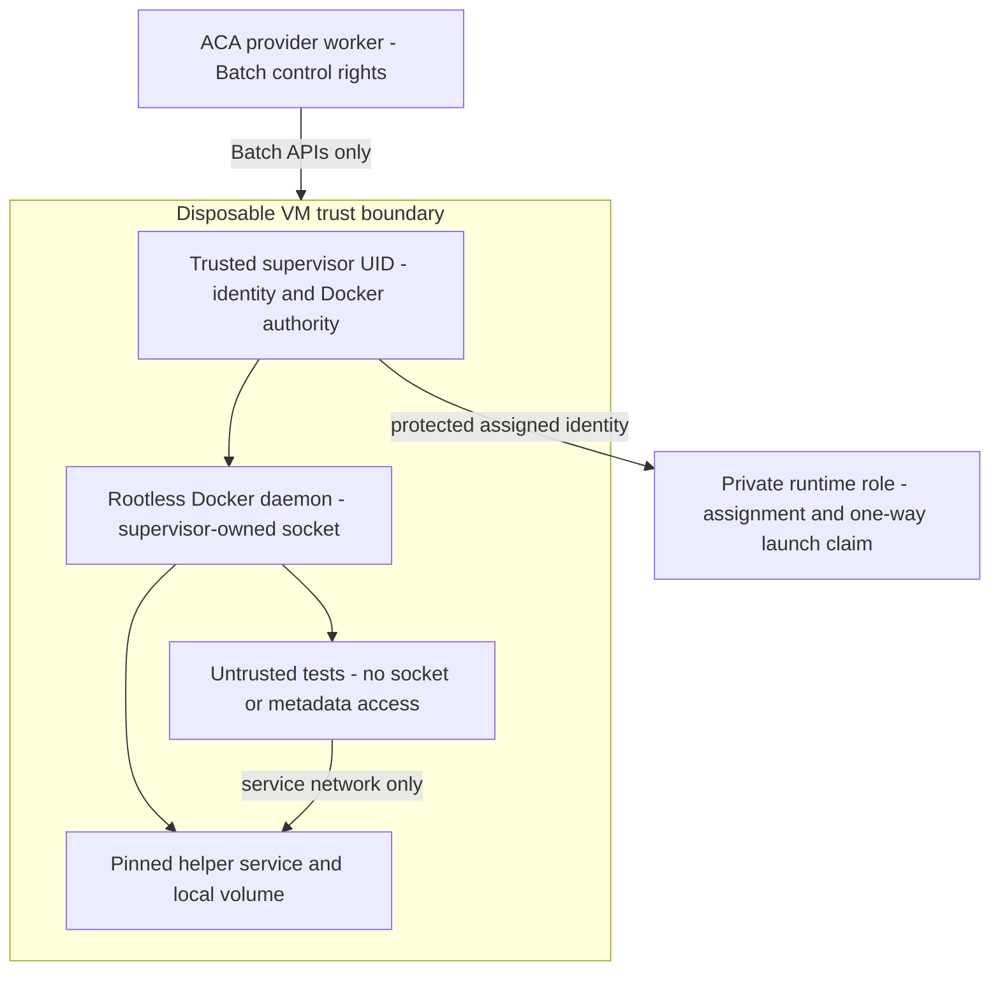

# 6. Compute provider, isolation, and image design

**Status:** proposed experiment, not a verified Batch architecture. [Index](README.md).

## Contract

The following is interface-level design, not repository scaffolding. Methods take an authenticated internal execution binding, context/deadline and immutable portable spec; adapters resolve restricted provider configuration outside workflow history.

```text
validate(spec, binding)                         -> capabilities / validation errors
reconcile(execution_id, spec_digest, binding)    -> found(handle) | absent | uncertain | mismatch
submit(spec, execution_id, binding)             -> internal handle
get_status(handle)                             -> normalized observation + observed timestamps
cancel(handle)                                 -> requested | stopped | already_terminal | uncertain
collect_results(handle, page)                  -> verified manifest refs + delivery status
cleanup(handle_or_execution_id)                -> pending | removed | uncertain + evidence refs
```

`reconcile` is the deliberate addition to the source's six-method contract; `cleanup` accepts execution ID when submit lost its handle. Internal handles never contain public credentials or escape through the public response. The fake persists its external-world model independently of worker memory and can inject acceptance-before-timeout, delayed creation, lost observations, and deletion failure. A process-local fake alone cannot prove restart behavior.

| Portable code | Meaning / retry classification |
| --- | --- |
| invalid_execution | Structurally invalid or unsupported capability; admission failure, no retry |
| policy_denied | Governed restriction/revocation; no retry without new eligibility |
| capacity_unavailable | Confirmed quota/capacity/allocation failure; bounded allocation policy, no fresh workload attempt |
| provisioning_failed | Confirmed bootstrap/node setup failure; terminal workload failure |
| image_unavailable | Admitted image cannot be fetched/verified; bounded transport retry, permanent trust failure stops |
| workload_failed | Observed nonzero exit/lost workload; no automatic rerun |
| execution_timed_out | Accepted-to-finish deadline expired; termination and cleanup continue |
| cancellation_failed | Stop could not be confirmed/request failed; visible exception, reconciliation continues |
| cleanup_failed | Absence/access revocation not established within budget; durable orphan ticket |
| provider_unavailable | Provider control path unreachable/throttled after bounded API retries; uncertainty retained |

Transport causes and detailed Azure diagnostics are stored as restricted evidence; codes are not inferred from arbitrary provider message strings. Fake and Azure conformance exercise normalized state/cleanup semantics, idempotence, late effects and unsupported capability denial. AWS/GCP remain design mappings in the final table, not adapters.

## Batch experiment topology and ownership

Recommend **user-subscription allocation mode only if** the platform team approves its service-principal blast radius and resource-inventory benefit in a dedicated nonproduction scope. Otherwise evaluate Batch-service mode, Microsoft's usual default recommendation. User-subscription mode puts compute/quota in the BU subscription and requires Batch service orchestration permissions, privileged bootstrap assignment authority, and a Batch-specific Key Vault in the same subscription/region with the documented Batch secret permissions. That vault is not an application-secret vault. Batch-service mode avoids those user-subscription allocation grants but still requires tested network/Gallery/identity access and Batch quotas. V05 records the choice, exact assignments and why it fits a BU subscription shared with other apps; no worker Contributor role substitutes for that review. [Batch account setup](https://learn.microsoft.com/en-us/azure/batch/batch-account-create-portal), [Batch mode guidance](https://learn.microsoft.com/en-us/azure/batch/best-practices#pool-configuration-and-naming), [Gallery pools](https://learn.microsoft.com/en-us/azure/batch/batch-sig-images).

Create a dedicated pool for each execution from an approved internal blueprint: one dedicated node, one job, one task, no spot/low-priority capacity initially, no other execution ever assigned, and no automatic workload retry. Explicit single-task concurrency is necessary but insufficient: a reusable pool with one slot would still reuse the VM sequentially. Deterministic pool/job/task names derive from execution ID and are recorded before creation. Set maximum task and job lifetime; delete the pool/node after bounded results collection, retaining a duplicate-detection marker as described in section 5. Inspect deletion to completion and reconcile delayed allocation.

Use the retained, completed execution-derived Batch job as the provider duplicate marker after pool removal, together with the DB `submission_closed` tombstone; job/pool IDs are account-relative and task IDs job-relative. Do not delete the job until outstanding requests and retry windows have settled. Resource absence by itself never authorizes a new identity. Batch-internal node-failure reexecution is independent of nonzero-exit retries: M2 must prove the prelaunch claim in section 5 prevents a second untrusted launch, not merely detect a later requeue.

Capacity accounting includes active, allocating and deleting pools, reserved identities, unknown resources and any prewarmed capacity. Published pool quotas range from 0–100 by default, with a listed maximum of 500 before further support review; active job quotas are separate. Read actual account/subscription/IP quotas before setting concurrency. Keep cold-only as the first cohort. An optional unused-warm experiment pre-creates a pool already bound to a reserved execution ID/spec/identity/deadline; it is never a generic pool reassigned to another execution and its idle time counts toward spend/lifetime. A shared pool with fresh nodes might reduce churn but does not automatically preserve Batch's pool-level isolation boundary; it needs a separate ADR/threat test, not just deletion of used nodes. [Quotas](https://learn.microsoft.com/en-us/azure/batch/batch-quota-limit), [Batch isolation](https://learn.microsoft.com/en-us/azure/batch/best-practices#isolation-boundary).

Terraform owns the Batch account, identity/RBAC assignments, networking, Gallery and immutable blueprint **configuration**. It does not manage these runtime pool instances or their target-node counts. Batch APIs own pool/job/task/capacity operations. Do not mutate Batch-owned VMSS/VMs through Compute APIs, even during failure recovery. Read-only resource inventory may supplement Batch evidence if permitted. This avoids Terraform/runtime property contention entirely in the proposed first topology.

Documented Batch container configuration and pool managed identities justify an experiment; they do not establish Docker socket safety, Compose support, or no-reuse cleanup. [Batch container workloads](https://learn.microsoft.com/en-us/azure/batch/batch-docker-container-workloads), [Pool managed identities](https://learn.microsoft.com/en-us/azure/batch/managed-identity-pools).

## Exact demo and Docker authority

Proposed workload: immutable source archive + approved entrypoint image running deterministic tests against one pinned helper database/service container using a template-owned Compose definition. Demonstrate container create/start/inspect/logs/stop, an execution-local network, and an execution-local volume, plus logs, observed test exit and the named `sbom` artifact defined in section 3. The trusted supervisor performs Compose operations; untrusted tests receive only service-network access and approved local input/output mounts. Confirm this exercises the actual representative use case at D04/V07; if tests themselves must call Docker, choose the alternative before implementation. Disable builds, privileged containers, host namespaces, host devices, arbitrary bind mounts, and caller-provided Compose configuration for this template.

Mounting the unrestricted rootful host Docker socket gives the workload effective host authority. Host iptables rules or hiding an identity token from a nominal container are therefore insufficient. This inference follows from Docker's documented daemon attack surface. [Docker security](https://docs.docker.com/engine/security/).

Recommended candidate: a Batch task invokes a trusted host supervisor controlling a rootless daemon under a separate host UID. The supervisor validates the complete pinned Compose configuration and image set before starting it. Untrusted tests get no Docker socket/API endpoint, supervisor files or host privilege. This removes the bespoke Docker request broker from the recommended path, not the required Docker functionality or isolation tests. Native Batch container mode remains an alternative only if it satisfies the same mechanism.

If direct untrusted Docker calls are required, compare a rootless daemon plus a policy broker against a stronger nested-runtime isolation boundary. A broker is security-critical, not a small assumed component: scope endpoints and indirect/streaming operations, assign an owner and explicit M2 work package, test denial bypasses, and pin its supply chain before V07. No stock proxy, nested runtime or host-root VM is preapproved as equivalent. [Rootless Docker](https://docs.docker.com/engine/security/rootless/), [Docker authorization limitations](https://docs.docker.com/engine/extend/plugins_authorization/).

For a future build-enabled template, admit the builder and complete base/helper image set, prohibit ungoverned downloads and secret-containing layers, scan/attest output, and require approval before a newly built digest may run. Source execution within the admitted entrypoint is untrusted by definition; approving its image does not certify repository code. The first template deliberately exercises pull-and-Compose without this additional build policy.

## Networking, identity, and data path

Use a workload subnet with no public node IP/inbound workload path, simplified Batch node communication and approved private node-management/account access where required. Provide explicit controlled outbound connectivity, private DNS and private endpoints for approved registry/artifact/vault services. Do not depend on implicit Azure outbound access. Test allowed registry, source-package, identity, Batch, DNS, telemetry and time endpoints and deny arbitrary internet/control-plane/lateral destinations. [Batch without public IPs](https://learn.microsoft.com/en-us/azure/batch/simplified-node-communication-pool-no-public-ip).

The supervisor performs registry pulls with a narrowly scoped managed identity; disable registry admin credentials and key-based fallback. No pool identity carries provider-control permissions. Exclude registry tokens/caches and Batch agent secrets from the workload user and daemon's filesystem reach. Block workload-originated IMDS and Azure platform endpoint access at a boundary the allowed workload cannot modify; test host-network, IPv6/redirect, alternate Docker calls, and metadata DNS/IP paths. If its granted Docker features can bypass that boundary, the experiment fails. A claim of removing an identity after bootstrap must include token lifetime/cache and Batch compatibility evidence; removal is not immediate token revocation.

Mechanism candidate for M2.1: root-owned host policy separates supervisor UID/rootless networking from the untrusted workload UID/network namespace; firewall/cgroup rules deny workload-originated metadata and control-plane traffic across IPv4/IPv6, with explicit approved egress. No host networking, Docker socket, writable host policy mount, `CAP_NET_ADMIN`, privilege escalation or host-user credential directory is exposed. Packet attribution through rootless networking must be demonstrated, not assumed from a bridge rule. Use Entra-only Batch authentication; do not introduce the retired Batch task-authentication token. Inventory agent files/environment and demonstrate they are unreadable from the actual workload. Failure to establish this enforcement point blocks the experiment.

Prepublish the source archive through trusted CI. The supervisor downloads only assigned input digests and uploads only assigned output objects; untrusted tests see execution-local files. A private broker can issue an execution-scoped transfer session authenticated through an approved node identity/assignment, but cannot manufacture a general API token issuer. The node principal must not impersonate another active assignment. For a finite experiment, recommend pre-provisioned **one-use** execution identities with no reassignment to a different execution, or an approved narrowly scoped broker session with independently verified assignment/expiry controls. Reassigning a principal while an old token remains valid is unsafe. V06 must settle the identity pattern before live untrusted work, including the secret-free demo. Short-lived access material stays in protected memory/files, never Batch task metadata, command arguments, custom data or history.

Recommended finite M2 identity lifecycle: pre-create one UAMI for each planned execution (including fault runs and reserved warm cases), record inventory/assignment/expiry, and refuse admission when inventory is exhausted. Pools with UAMIs require Batch management-plane creation; provider assignment rights are limited to those exact identities. The runtime role validates Entra tenant/audience/principal against its immutable execution binding and provider-observed expected node; the protected supervisor consumes the launch claim before any untrusted process. Identity reuse is disabled for the POC. After verified node removal, retire grants/assignment, reject that principal at the runtime service, retain tombstones through token/restore windows and audit later identity deletion. Azure grant propagation and node-wide IMDS accessibility remain V06 tests. A reusable identity pool requires a new proof covering minting cessation, stale tokens, quarantine and reassignment—not merely a nominal token-expiry wait. [Managed-identity pools](https://learn.microsoft.com/en-us/azure/batch/managed-identity-pools).

For the secret-free demo, `secret_refs=[]`. M3's schema still rejects unauthorized references; enabled secret policies require separate application-vault access through the scoped broker and runtime tests. Policy references identify an allowed purpose/version, not an arbitrary vault URI. No cloud URLs/credentials are returned through logs/results; public artifact downloads remain API-authorized. Input/output stores are separate from future Terraform state and immutable audit evidence.

Outputs are untrusted: enforce byte limits, safe archive/path extraction, no symlink traversal, checksums, media-type handling, log sanitization and quarantine where scanning is required. Workload claims of success, cleanup or absence never override provider observations. Stop/maximum lifetime and cleanup remain outside the untrusted process.

## Two image supply chains

| Control | OCI chain | Worker VM chain |
| --- | --- | --- |
| Build | Trusted source/build definition and approved base digests | Approved OS source + image-builder pipeline, kernel/Docker/agent hardening |
| Evidence | Scan, SBOM, provenance, digest, signature/attestation | OS/package manifest, builder provenance, scan, isolation and bootstrap test results |
| Approval | Workload image owner and security criteria | Platform image owner, independently approved baseline |
| Promotion | Immutable registry digest + immutable template version | Explicit Compute Gallery image **version**, region replication and compatible Batch node agent |
| Runtime check | Recheck current allowlist/revocation and signatures before start and helper pulls | Resolve only approved internal image version; record actual booted version |
| Updates | New digest; revoked digest cannot start | Replace nodes; do not patch/reuse a running workload VM |
| Rollback / EOL | Return to a still-approved digest only | Previous still-supported Gallery version; never bypass security revocation |

Proposed owner policy for review: weekly vulnerability review and monthly routine image rebuild; security team sets severity thresholds and emergency patch deadlines in V09. A revoked image stops new admission immediately; policy owner decides whether running affected executions must be cancelled. Documented/manual approval is allowed during the POC, but admission, pinning and baseline isolation enforcement must function. Cached layers do not bypass checks. Record worker image identifier only in internal evidence; the public request chooses `isolated-vm` and governed profiles.

Verification proposal: reuse the approved enterprise verifier; absent one, evaluate pinned Cosign signature/attestation verification for OCI digests and signed worker-image manifests. V09 names the trust root/allowed signing identity and issuer (or approved public key), required attestation predicates, offline bundle/registry access, expiry and revocation rules. The publisher validates before catalog promotion; the trusted supervisor verifies entrypoint and helper digests before each start/pull. Rotation publishes an independently approved overlapping trust bundle, tests old/new/revoked signers, then retires old trust; unavailable verification fails closed. Tool version/root values remain owner decisions, not placeholders treated as trusted. [Cosign verification](https://docs.sigstore.dev/cosign/verifying/verify/).



## Batch viability experiment and decision record

Run only after M1 acceptance and separate M2 authorization. First inventory approved target, quotas, image versions, identity grants and network rules. Capture the exact OS/kernel, Docker/Compose, node-agent SKU, Gallery version, entrypoint/helper digests, Azure API/SDK versions and pool allocation configuration. V07–V11 define the evidence files and pass conditions.

| Experiment | Required evidence |
| --- | --- |
| Docker and workspace | Exact deterministic tests/Compose subset, mounts/volume cleanup, cgroup limits, denied extra capabilities |
| Identity and image | Pull with managed identity, disabled static credentials, denied mutable/revoked/helper digests, no cross-execution access |
| Isolation attacks | IMDS/agent credential/host file/socket access attempts; lateral artifact and network denials; mutation attempts cannot remove controls |
| Scheduling and retries | One execution/VM, node failure does not rerun workload, duplicate and ambiguous submission preserve single identity |
| Network | Required private DNS/endpoints work; disallowed egress logged and blocked; no workload ingress |
| Termination and cleanup | During allocation and running; late allocation/submit; pool/node removal, session expiry/revocation, no residual workspace orphans |
| Observability and data | Logs/results/artifact, consistent execution correlation, safe telemetry, staging-registration recovery |
| Performance and spend | Cold and optional unused-warm cohorts, sample counts, queue/allocation/readiness/pull/start/cleanup p50/p95, billable lifetimes and cost basis |

Continue with Batch only if all security/lifecycle requirements pass and agreed performance/spend limits are met. If evidence is incomplete, decision is pending. If Batch fails, record the exact failing requirement and test VMSS against it before choosing. Reimaging is outside the baseline and cannot substitute for removal without explicit reviewed evidence. Warm nodes may be prebooted but **unused**; once assigned, remove them rather than returning them to a shared pool.

## VMSS fallback and portability

Direct VMSS is a separate adapter and fleet: select a supported orchestration mode after comparing identity, instance deletion and image requirements; start from a homogeneous disposable fleet if it meets them. It must own capacity ceilings, durable per-instance claims/fences, bootstrap/readiness, health leases, draining, forced deletion, maximum lifetime, and orphan reconciliation. Never point it at Batch-owned compute. [VMSS orchestration modes](https://learn.microsoft.com/en-us/azure/virtual-machine-scale-sets/virtual-machine-scale-sets-orchestration-modes).

| Portable need | Azure candidate | Directional AWS / GCP mapping, unverified |
| --- | --- | --- |
| Disposable VM + exact Docker subset | Batch node; direct VMSS fallback | EC2 fleet/Batch on EC2; Compute Engine/Cloud Batch, subject to same no-reuse tests |
| Logical profiles and private network | Internal region/SKU/VNet bindings | Internal instance/VPC bindings; machine/network bindings |
| Scoped artifact/secret identity | Managed identity + approved scoped delivery | Temporary IAM credentials / service-account access with equivalent scope tests |
| Approved OCI + worker image | Approved registry + Compute Gallery | ECR/AMI; Artifact Registry/image version |
| Reconcile/stop/absence | Deterministic IDs and provider reads | Adapter must prove idempotence and late-effect recovery for its scheduler |

These mappings identify no required new public field for the proposed subset; they do not demonstrate equivalent scheduler security or workload portability in an untested cloud.
