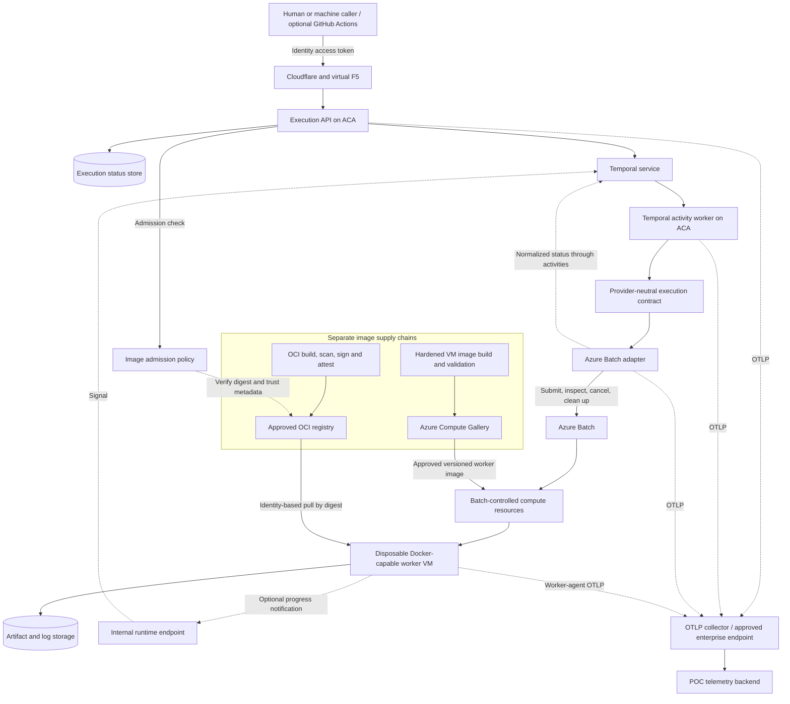

# Portable Compute Execution Platform — POC Intent and Requirements

**Source:** Manager's photographed *Portable Compute Execution Platform — Proof of Concept Plan*, working draft, last updated **2026-09-03**.  
**Initial provider:** Microsoft Azure.  
**Reconstructed:** 2026-09-05 from all 23 photographs, `IMG_2392.jpeg` through `IMG_2414.jpeg`, in filename order.

**Current starting instructions:** [Combined build prompt](/home/zerocool/github/forgeapi-homelab/docs/combined-build-prompt.md). This document preserves the source requirements; the combined prompt establishes the delivery sequence and architecture direction.

**Source-photo disposition:** All 23 original JPEGs were deleted on 2026-09-05 at the user's request after verifying substantive coverage. This reconstruction and the [OCR text](/home/zerocool/github/forgeapi-homelab/portable_compute_execution_ocr.md) are retained. Appendix C preserves the original filenames as provenance, not links to available images.

This document consolidates the intent and requirements visible in the photographs. It retains the original 25-section numbering, removes repeated explanations, and recreates the conceptual diagram. Requirements below describe the source draft; they are not evidence that a capability has been implemented, tested, or approved. Product assumptions have not been independently validated in this reconstruction.

Proposed choices, conditional features, deferred work, and open questions remain identified as such. The sample image digest was clipped in the photograph and is represented by an explicit placeholder. Appendix A records ambiguities; Appendix B separately compares this POC with the earlier infrastructure-provisioning prompt. Neither appendix silently changes the source requirements. Appendix C maps every photograph to the content captured here. Appendix D records the user's subsequent clarification: build the shared API foundation first, then deliver this compute POC as its first supported capability.

## 1. Executive summary

The POC should establish whether a secure, provider-neutral API can execute an isolated OCI container workload while hiding cloud compute implementation details from callers.

The proposed initial architecture consists of:

- A REST API aligned with the applicable Zalando guidelines, hosted on Azure Container Apps (ACA).
- Temporal for durable execution lifecycle orchestration, with Temporal activity workers on ACA.
- A provider-neutral execution adapter contract.
- Azure Batch as the initial compute scheduler and provider implementation.
- Disposable, Docker-capable Azure VMs for actual workload execution.

Azure Batch is a replaceable implementation choice. If experiments show that it cannot meet Docker, isolation, networking, startup, or lifecycle requirements, evaluate a direct Azure Virtual Machine Scale Sets (VMSS) adapter while preserving the public API and provider-neutral workflow.

Only Azure is implemented during the POC and initial product phase. Provider selection is internal configuration; callers do not select Azure or supply Azure-specific settings. Portability is demonstrated through a fake provider, shared conformance tests, and documented AWS/GCP mappings. Implementing AWS/GCP, cross-cloud placement, and failover is deferred.

The intended product behavior is **submit a governed workload, execute it on isolated temporary compute, observe its result, and verify cleanup**. Terraform provisions the long-lived platform foundation; it does not run once per submitted workload.

## 2. Goal and hypothesis

Prove that one portable execution specification can run an isolated OCI workload through a cloud-specific adapter without exposing the provider to the caller.

The hypothesis is supported when:

1. The Azure adapter and a contract-test fake accept the same public request.
2. The Temporal workflow contains no Azure-specific orchestration logic.
3. States, failures, cancellation, results, and cleanup have normalized semantics.
4. The selected workload can use the exact Docker functionality it needs.
5. Authentication, authorization, isolation, auditing, and credential handling meet the POC security baseline.
6. A plausible AWS or GCP adapter could support the selected workload without changing the public API or workflow contract.

## 3. Guiding principles

- **Describe workload intent:** callers select capabilities and constraints instead of cloud resources.
- **Keep the public contract portable:** Azure is the first implementation, not the public vocabulary.
- **Use identity-based access:** prohibit long-lived API keys and shared cloud credentials.
- **Assume workload code is untrusted:** isolation is a fundamental execution requirement.
- **Separate orchestration from scheduling:** Temporal owns the platform lifecycle; the provider owns cloud scheduling and compute allocation.
- **Use governed named capabilities:** preserve useful functionality without exposing provider-specific settings.
- **Make external operations idempotent and reconcilable:** tolerate retries, duplicates, and partial failures.
- **Measure uncertain behavior:** demonstrate Docker support, latency, isolation, and cleanup.
- **Build in diagnostic visibility:** propagate portable telemetry context across the execution path.

## 4. Scope

### 4.1 In scope

- Provider-neutral execution model and Zalando-aligned OpenAPI contract.
- Entra authentication and application/object-level authorization.
- ACA-hosted API and Temporal workflow/activity workers.
- Execution provider interface, fake provider, Azure Batch implementation, and shared conformance tests.
- One isolated workload per disposable worker VM.
- OCI execution from an approved registry.
- Submission, status, cancellation, timeout, logs, results, and cleanup.
- Managed identities, least-privilege RBAC, and appropriate network/egress restrictions.
- Correlated audit events across API, Temporal, provider, and workload worker.
- Minimal OpenTelemetry instrumentation across API, activities, adapter, and worker agent.
- Directional AWS/GCP implementation mappings.
- A narrow GitHub Actions sample caller, **if time permits**.

### 4.2 Out of scope

- Production deployment, production SLOs, and a complete production support/ownership model.
- Live AWS/GCP implementations; cross-cloud scheduling, failover, or arbitrage.
- A complete software-factory platform or general-purpose workflow authoring.
- Interactive VMs, general shell access, long-running web services, and public workload ingress.
- Persistent volumes and GPU support.
- Full Fly.io API compatibility.
- ServiceNow workflow implementation.
- Advanced cost optimization, chargeback, or forecasting.
- Large compute-profile catalogs and broad self-service onboarding.
- Production telemetry pipelines, collector high availability, alerting, and retention engineering.

### 4.3 Initial product phase boundary

| Concern | Source position |
| --- | --- |
| Public API and domain model | Cloud-agnostic |
| Temporal workflow | Cloud-agnostic |
| Provider contract and errors | Cloud-agnostic |
| Runtime provider selection | Internal; fixed to Azure |
| Live provider implementation | Azure Batch first; direct VMSS fallback |
| AWS/GCP | Design mappings and contract review only |
| Multi-cloud placement and failover | Deferred |

The work-plan phases in section 17 are delivery stages **within** this Azure-focused initial product phase, not separate product releases. Do not build speculative AWS/GCP code merely to claim portability.

## 5. Primary demonstration use case

Use one representative **isolated pull-request validation workload** that needs meaningful Docker functionality.

The execution should:

1. Receive an immutable repository and commit reference.
2. Start on a disposable VM.
3. Build or pull an approved workload image, as required by the selected demonstration.
4. Run deterministic tests needing Docker, potentially sibling containers or Docker Compose.
5. Produce test results, logs, and one artifact such as an SBOM or scan report.
6. Return a normalized terminal result.
7. Remove the worker and revoke execution-scoped access.

GitHub Actions may submit the execution and publish a GitHub Check. That integration is illustrative and is not the core POC.

## 6. Conceptual architecture

The following diagram is a simplified reconstruction of the source diagram and accompanying descriptions.



Cloudflare/F5 appears in the proposed architecture; whether external ingress is required for the demonstration remains open. Temporal service hosting also remains open in the source.

**A worker fleet has one controller.** With the Batch adapter, Batch owns its underlying compute resources. The platform does not independently modify Batch-owned VMSS or VM instances. With a direct VMSS adapter, the platform explicitly assumes responsibility for allocation, assignment, readiness, health, draining, deletion, maximum lifetime, and orphan reconciliation.

## 7. Component responsibilities

| Component | Owns | Must not own |
| --- | --- | --- |
| Public API | Authentication, authorization, validation, idempotency, execution resource creation, status projection | Cloud-specific provisioning |
| Temporal workflow | Durable lifecycle, portable retry decisions, cancellation, timeout, cleanup, reconciliation | Azure SDK calls or provider-specific state transitions |
| Temporal activities | External calls, configured provider selection, status retrieval, artifact registration | Public resource semantics |
| Provider contract | Portable validation, submission, inspection, cancellation, results, cleanup | Provider implementation details |
| Azure Batch adapter | Translation to Batch pools/jobs/tasks and normalized results | Public API decisions |
| Azure Batch | Node allocation, task placement, container execution, task state | Cross-provider orchestration |
| Batch-controlled compute | VM capacity under Batch control | Independent platform scaling or lifecycle decisions |
| Direct VMSS adapter, if selected | Creation, assignment, draining, deletion of directly managed instances | Modification of Batch-owned compute |
| OCI image pipeline and registry | Workload-image build, scan, signing, attestation, distribution | Worker VM lifecycle |
| VM image pipeline and gallery | Worker-image build, hardening, validation, versioning, publication | Caller-selected workload behavior |
| Image admission policy | Registry, digest, signature, provenance, approved-use verification | Image building or mutable image resolution |

## 8. Public API direction

### 8.1 Contract conventions and proposed resources

Follow the applicable Zalando RESTful API Guidelines and the organization's internal interpretation. Record the authoritative guideline version and lint rules before finalizing OpenAPI. Final paths, asynchronous response codes, pagination, media types, and versioning remain subject to those rules. Do not expose RPC-style provider actions.

```text
POST /executions
GET  /executions/{execution_id}
POST /executions/{execution_id}/cancellations
GET  /executions/{execution_id}/logs
GET  /executions/{execution_id}/events

GET  /execution-templates
POST /execution-templates/{template_id}/executions
```

Creation must support an idempotency key. Errors use the organization-approved problem-details representation. Consumer responses must not expose secrets, opaque provider references, or cloud metadata.

### 8.2 Illustrative request

The digest placeholder below replaces text clipped in the photograph. Profile and template names are illustrative, not a final catalog.

```json
{
  "template_id": "pr-validation-v1",
  "image": "registry.example.com/software-factory/reviewer@sha256:<approved-digest>",
  "command": ["review", "--source-ref", "artifact:source-01"],
  "compute_profile": "general-medium",
  "execution_class": "isolated-vm",
  "placement_policy": "us-data-residency",
  "network_profile": "software-factory-restricted",
  "timeout_seconds": 1800,
  "environment": {
    "RUN_MODE": "pull-request"
  },
  "secret_refs": ["github-read-token"],
  "input_artifact_refs": ["source-01"]
}
```

Callers do not provide cloud regions, VM SKUs, subscriptions, projects, accounts, subnets, security groups, pool names, or cloud-specific identities. Secret references identify governed credential-delivery policies; they are not secret values.

### 8.3 Illustrative response

```json
{
  "id": "exec_01k4example",
  "state": "accepted",
  "created_at": "2026-09-03T15:00:00Z",
  "links": {
    "self": "/executions/exec_01k4example",
    "logs": "/executions/exec_01k4example/logs",
    "events": "/executions/exec_01k4example/events"
  }
}
```

### 8.4 Governed portable profiles

| Public concept | Illustrative internal Azure mapping |
| --- | --- |
| `general-medium` | Approved VM SKU |
| `isolated-vm` | Disposable Batch node |
| `us-data-residency` | Approved US region |
| `software-factory-restricted` | VNet, DNS, firewall, and egress policy |
| `github-read-token` | Execution-scoped credential-delivery policy |

Profile definitions are operator-managed policy. Callers select approved profiles rather than defining arbitrary infrastructure settings.

## 9. Execution lifecycle and sources of truth

The source gives this provider-neutral lifecycle outline:

```text
accepted → provisioning → starting → running
                                      ├─ succeeded
                                      ├─ failed
                                      ├─ cancelled
                                      └─ timed_out
```

This is an outline, not a complete transition matrix; the required tests also include cancellation during provisioning.

Cleanup has an independent state:

```text
cleanup_state: pending | running | succeeded | failed
```

Retain both workload and cleanup outcomes. Workload success does not imply compute removal. Successful work with failed cleanup is an operational exception.

| Concern | Authoritative source |
| --- | --- |
| Consumer-visible execution projection | Execution status store |
| Durable orchestration history | Temporal |
| Provider task and node state | Azure Batch |
| Logs and output artifacts | Artifact store |
| Azure administrative operations | Azure Activity Log |

Correlate all sources using the platform execution ID. Keep the opaque provider reference in internal state only.

## 10. Temporal design

Keep workflows deterministic and provider-neutral. Put all network and Azure SDK calls in activities.

Proposed orchestration:

```text
Validate persisted execution
→ Resolve governed profiles
→ Select configured provider
→ Submit idempotently
→ Wait using durable timers and short status activities
→ Handle cancellation or timeout
→ Collect normalized result
→ Clean up
→ Update terminal projection and emit event
```

Do not keep one activity open for the complete workload duration. Use periodic short status activities and durable timers. Worker callbacks or an event bridge may accelerate progress reporting, but polling and reconciliation remain the recovery mechanism.

Separate retry ownership:

- Temporal may retry transient failures of an idempotent provider API call.
- Batch may retry actual task execution only under an explicit execution retry policy.
- A failed status request must not cause Temporal to create a second provider execution.
- Cancellation and timeout must converge even when provider calls are retried.

Temporal inputs, outputs, and history contain references rather than credentials or sensitive workload content.

## 11. Provider contract

The proposed logical interface is:

```text
validate(execution_spec)                    → validation_result
submit(execution_spec, execution_id)         → opaque_provider_reference
get_status(provider_reference)              → normalized_status
cancel(provider_reference)                  → cancellation_result
collect_results(provider_reference)         → result_references
cleanup(provider_reference)                 → cleanup_result
```

Required properties:

- Every operation is idempotent or has an idempotent wrapper.
- Provider references never cross the public boundary.
- Errors map into a small documented portable taxonomy.
- Validate adapter capabilities before submission.
- Run the same required contract tests against fake and Azure implementations.
- Retain detailed provider diagnostics for operators without changing the public response schema.

Initial error codes, to be refined and mapped to approved problem details:

```text
invalid_execution
policy_denied
capacity_unavailable
provisioning_failed
image_unavailable
workload_failed
execution_timed_out
cancellation_failed
cleanup_failed
provider_unavailable
```

## 12. Azure implementation

### 12.1 Proposed services and Terraform boundary

| Capability | Initial choice in the source |
| --- | --- |
| Public control-plane runtime | Azure Container Apps |
| Durable orchestration | Temporal workers on ACA; Temporal service location TBD |
| Compute scheduling | Azure Batch |
| Workload compute | Azure VMs supplied through Batch-controlled compute resources |
| Workload registry | ACR or approved enterprise OCI registry |
| Worker image catalog | Azure Compute Gallery |
| Secrets | Key Vault with RBAC authorization |
| Artifacts/logs | Approved object storage with identity-based access |
| Perimeter/networking | Cloudflare, virtual F5, private Azure networking, governed egress |
| Enterprise observability | Logging, metrics, tracing, SIEM integrations |
| Minimum POC telemetry | OpenTelemetry SDKs and one OTLP collector/export path |
| Platform provisioning | Terraform for long-lived resources |

Terraform defines the platform foundation: accounts, pool models, images, networks, identities, policies, and service deployments. Runtime capacity changes occur through the selected provider API. The design does not create a Terraform resource or run Terraform for each execution.

### 12.2 Batch and direct VMSS are alternative ownership models

With Batch:

```text
Temporal → provider activity → Batch job/task/pool APIs
         → Batch-controlled compute → Docker-capable node → container
```

The adapter may use an existing governed pool, create an approved automatic pool, or request target pool capacity, depending on the selected POC design. Batch allocates the underlying VMs and places tasks. Observe task/node state through Batch APIs and reconcile against Batch state. The platform must not use Compute/VMSS APIs to mutate Batch-owned instances.

The source notes that underlying resource visibility can depend on the pool allocation model; operational ownership must be verified during the experiment.

With direct VMSS, if selected:

```text
Temporal → provider activity → Compute/VMSS APIs
         → platform-controlled VM → bootstrap/job claim → container
```

The platform then owns capacity, instance-to-execution assignment, readiness, health, draining, deletion, maximum lifetime, and orphan reconciliation. This added responsibility is justified only if Batch cannot meet the required behavior. Never combine Batch scheduling with independent mutation of the same underlying fleet.

### 12.3 First technical decision gate: Batch viability

The experiment must validate the selected workload's exact requirements:

- Docker engine access; sibling-container/Compose behavior if needed.
- Approved runtime configuration, volumes, and workspace behavior.
- ACR authentication without static credentials.
- Private DNS and required network access.
- Log and artifact collection.
- Cancellation and forced termination.
- One workload per disposable VM.
- Removal or verified reimaging before another untrusted workload; acceptance of reimaging remains open.
- Visibility and operational ownership of Batch-created compute.
- Runtime scaling through Batch, with no direct mutation of Batch-owned VMSS.
- Acceptable allocation and startup latency.

If Batch cannot satisfy these safely and predictably, evaluate direct VMSS while retaining the API, workflow, and provider contract.

### 12.4 Two separate image supply chains

| Image | Purpose | Portability/location |
| --- | --- | --- |
| Workload OCI image | Caller workload | Portable where runtime compatibility permits; approved OCI registry |
| Worker VM image | OS, Docker, agent, monitoring, host security | Provider-specific and hidden; Azure Compute Gallery initially |

Workload image flow:

```text
Source/build definition → controlled build → vulnerability/policy checks
→ SBOM, provenance, signature or attestation → approved registry
→ admission verification → identity-based pull by immutable digest → execution
```

Worker VM image flow:

```text
Approved base OS → Azure Image Builder, Packer, or approved pipeline
→ hardening/validation → Docker, agent, monitoring, security tooling
→ versioned Compute Gallery image → Batch pool or direct VMSS → worker VM
```

Phase 1 image controls:

- Pin execution to an admitted immutable OCI digest.
- Allow only approved registries, repositories, base images, and worker-image versions.
- Use managed/federated identity for pulls; do not distribute registry passwords/admin credentials.
- Record the OCI digest and worker-image version in internal audit records.
- Keep cloud-specific worker-image identifiers out of the public API and workflow contract.
- Promote, deprecate, and roll back worker-image versions through the platform release process.
- Replace nodes to adopt a new image instead of modifying running workers in place.
- Define patch cadence, vulnerability thresholds, emergency revocation, and end-of-life policy for both image types.
- Treat cached layers only as an optimization; still validate digest and policy.

Callers may reference an approved OCI repository and digest, or use a template resolving to one. They do not choose a worker VM image, provide registry credentials, or select mutable image tags for execution. Future adapters map governed worker-image profiles to their own image catalogs internally.

## 13. Security architecture

Security is a POC acceptance requirement. In the source, **“no API keys” means no long-lived shared credentials**. Short-lived OAuth tokens, workload identities, managed identities, and approved certificates are permitted.

### 13.1 Identity boundaries

Use distinct identities for:

1. Human or machine caller.
2. Public API workload.
3. Temporal activity worker.
4. Azure Batch control-plane operations.
5. Worker bootstrap operations.
6. Individual workload access, where needed.

The public API has **no Azure compute provisioning permissions**. The Azure provider activity worker receives narrowly scoped rights for the configured Batch resources. Optional GitHub Actions access uses OIDC workload federation instead of stored Azure client secrets.

### 13.2 Application authorization

Enforce object-level authorization in addition to Azure RBAC. Initial logical roles:

- Execution submitter.
- Execution reader.
- Execution canceller.
- Template administrator.
- Platform operator.
- Security auditor.

Knowing an execution ID does not grant access. Decisions consider caller identity, tenant/team ownership, template, operation, and policy.

### 13.3 Least privilege and credentials

- Prefer custom roles when built-in roles are materially broader than needed.
- Scope roles to the smallest applicable resource boundary.
- Separate control-plane and data-plane identities.
- Disable registry admin credentials, shared storage keys, and local/shared-key authentication where supported.
- Retrieve secrets through identity-based access at execution time.
- Never place credentials in API payloads, Temporal history, Batch metadata, VM custom data, command lines, or logs.

### 13.4 Untrusted workload isolation

- One untrusted execution per disposable VM.
- No workspace or credential reuse across executions.
- No platform control-plane credentials available to the workload.
- Block or broker workload access to Azure Instance Metadata Service.
- Restrict and log outbound network access.
- Run only approved, digest-pinned images.
- Enforce CPU, memory, runtime, and storage limits.
- Use ephemeral workspaces and verify cleanup.
- No inbound workload traffic during the POC.

### 13.5 Temporal security

- Store references instead of resolved secrets in inputs/history; do not return secrets from activities.
- Use approved authentication and encryption configuration.
- Evaluate a payload codec for regulated sensitive data.
- Restrict namespace/task-queue access and define history retention requirements.

These are security requirements from the source; the enforcement mechanisms remain to be selected and verified.

### 13.6 Supply-chain controls

Document or demonstrate registry/repository allowlists, digest pinning, vulnerability scanning, base-image ownership and patching, SBOM/provenance, signature verification, separate workload/worker-image approvals, and revocation of previously approved digests or versions.

Not every control must be fully automated during the POC, but the design must allow all of them.

## 14. Networking and data handling

### 14.1 Control plane

Proposed public/enterprise ingress uses Cloudflare and virtual F5. Entra authentication remains mandatory regardless of network perimeter. Internal services use private networking and identity-based access where supported. The source separately leaves internal-only demo ingress open.

### 14.2 Worker plane

- No public inbound route to workers.
- Outbound traffic follows a named network profile and enterprise egress controls.
- Explicitly allow required source, registry, secret, and artifact access.
- Document Batch/identity control-plane endpoints.
- Test DNS resolution and private endpoint dependencies.

### 14.3 Data

Prefer portable artifact references over cloud-native storage URLs in the API, with internal reference resolution.

The POC must identify accepted data classifications, residency locations, transit/at-rest encryption requirements, log/artifact retention, maximum input/output sizes, post-execution deletion expectations, and whether source code may persist outside the worker.

## 15. Observability and audit

OpenTelemetry is part of the POC because the execution path is distributed and asynchronous. The objective is enough visibility to evaluate behavior and diagnose failure.

Use one platform-generated `execution_id` across API logs, Temporal workflow IDs, provider operations, worker logs, artifacts, and audit events. It may appear in logs/traces/audit, **not metric labels**.

### 15.1 Minimum telemetry architecture

Instrument the API, Temporal activity worker, provider adapter, and worker agent using OpenTelemetry SDKs. Export OTLP to one collector or an approved enterprise endpoint and a POC backend.

Do not assume Batch emits application OpenTelemetry automatically. Instrument Batch interactions and normalized transitions in the adapter; instrument bootstrap and execution in the worker agent. Azure platform logs supplement this instrumentation.

### 15.2 Context propagation

- W3C Trace Context for synchronous HTTP/internal calls.
- Approved trace context through Temporal headers/interceptors.
- Execution ID and safe context in provider requests and worker assignments.
- Parent-child spans for short synchronous operations.
- Span links and execution events across durable/asynchronous boundaries.
- No single span held open for the entire minutes- or hours-long execution.
- Link cancellation, retry, timeout, and cleanup back to the originating execution.

### 15.3 Stages that must be distinguishable

1. Request receipt, authentication, authorization, admission.
2. Execution persistence and Temporal workflow start.
3. Provider/profile resolution.
4. Batch submission and response.
5. Capacity request and node-allocation observation.
6. Worker bootstrap and readiness.
7. Workload-image admission and pull.
8. Container start and completion.
9. Result/artifact publication.
10. Cancellation or timeout handling.
11. Provider/worker cleanup.

Use portable span vocabulary where possible. Provider account, pool, task, VMSS, and instance identifiers belong only in restricted operator telemetry, not public responses.

### 15.4 Structured logs and redaction

Include applicable execution, workflow, and activity IDs; service/component; portable state; provider operation; retry attempt; normalized error; worker-image version; OCI digest; and cleanup state.

Exclude access tokens, secret values, unapproved source content, full environment blocks, Temporal payloads, and sensitive command arguments. Redact before export.

### 15.5 Minimum metrics

- Execution counts by portable state/outcome.
- Queue, provisioning, VM readiness, image-pull, and container-start durations.
- Execution, cancellation, and cleanup durations.
- Provider API errors/throttling, capacity failures, and quota failures.
- Orphan detection and cleanup failures.
- Estimated compute consumption by execution class.

Bound labels to dimensions such as environment, execution class, compute profile, and normalized result. Do not label metrics with execution IDs, repositories, resource IDs, or user identities.

### 15.6 Audit evidence

Record caller and owning team; authorization/admission results; template and immutable image digest; repository/commit where applicable; selected compute/network/placement profiles; lifecycle transitions/timestamps; provider submission/cancellation/cleanup operations; terminal workload result; artifact references; and cleanup confirmation or exception.

Redact sensitive values and make security events suitable for enterprise SIEM forwarding.

### 15.7 Observability acceptance

A reviewer must be able to start with an execution ID, find all related telemetry, break down time by stage, identify failure cause and retry history, follow cancellation/timeout through cleanup, and determine whether compute was removed or an operational exception remains.

Production dashboards, alert rules, SLOs, collector clustering, sampling optimization, long-term retention engineering, and complete SIEM onboarding are deferred.

## 16. Failure and reconciliation scenarios

Exercise at least:

1. Duplicate submission using the same idempotency key.
2. Invalid or policy-denied request.
3. Provider submission timeout with an ambiguous response.
4. VM allocation or capacity failure.
5. Image-pull failure.
6. Workload nonzero exit.
7. Workload timeout.
8. Cancellation during provisioning.
9. Cancellation during execution.
10. Workload worker failure without a callback.
11. Temporal activity worker restart.
12. Cleanup failure or orphan detection.

Each scenario must converge to a documented state without silently creating duplicate executions.

## 17. POC work plan

These stages retain the source's phase numbering; they all sit within the Azure-only initial product phase.

| Stage | Required work |
| --- | --- |
| **Phase 0 — Confirm constraints** | Select workload/exact Docker features; confirm Zalando rules, Temporal hosting/access, subscription/region/quota/network path; complete a lightweight threat model. |
| **Phase 1 — Contract skeleton** | Define OpenAPI resources/problem responses, lifecycle/cleanup states, provider interface/errors; implement fake provider and conformance harness. |
| **Phase 2 — Secure control plane** | Deploy API/worker skeletons; configure Entra/managed identities; implement object authorization/audit correlation; persist secret-free status; instrument API/activity boundaries. |
| **Phase 3 — Azure Batch viability** | Provision minimal Batch foundation with Terraform; build/select Docker-capable worker image; run target workload through Batch manually; measure allocation/boot/pull/execution; decide Batch versus VMSS. |
| **Phase 4 — End-to-end integration** | Implement Azure activities; submit/observe through Temporal; implement cancellation/timeout/results/cleanup; add reconciliation/orphan detection; instrument adapter/agent and asynchronous trace links. |
| **Phase 5 — Security and failure validation** | Run authorization-negative tests and cross-execution artifact-access attempts; prove workload cannot obtain platform credentials; exercise failure/cancellation; review roles and audit evidence. |
| **Phase 6 — Demo and findings** | Add optional GitHub caller; capture performance/cost; demonstrate fake/Azure conformance; document findings, limitations, risks, and recommendation. |

## 18. Success criteria

| Category | Required evidence |
| --- | --- |
| Abstraction | Public OpenAPI has no Azure/AWS/GCP resource identifiers or provider-specific fields. |
| Initial scope | Azure is the only live provider; selection is internal. |
| Workflow portability | Workflow contains no Azure SDK calls or Azure-specific branching. |
| Provider isolation | All Azure operations sit behind the provider contract. |
| Contract conformance | Fake and Azure providers pass the same required tests. |
| Execution | Selected OCI workload completes on an isolated worker. |
| Lifecycle | Status, cancellation, timeout, results, and cleanup are observable with portable semantics. |
| Idempotency | Repeated submissions/provider calls do not create duplicate workload executions. |
| Authentication | API/provider operations use authentication without long-lived shared credentials. |
| Authorization | Negative tests show callers cannot access/cancel executions they do not own. |
| Least privilege | Identities/roles are documented and reviewed; the public API cannot provision compute. |
| Isolation | Workload cannot obtain platform credentials or another execution's data. |
| Image supply chain | Admitted OCI digest and approved versioned worker image; no static registry credentials. |
| Cleanup | All test executions are removed within an agreed window or raise a visible cleanup exception. |
| Audit | One correlation identifier traces an execution end to end. |
| OpenTelemetry | API, Temporal, provider, and worker telemetry form one logical view exported through OTLP. |
| Performance | Measure queue-to-container-start p50 and p95 against the selected use-case target. |
| Future portability | AWS/GCP mappings identify no necessary public contract change for the selected workload. |

Numeric latency, concurrency, cleanup, and cost thresholds remain to be agreed after the workload and business expectations are confirmed. Averages alone are insufficient; record at least p50 and p95.

## 19. Demonstration script

1. Show the provider-neutral OpenAPI request and authenticated caller.
2. Submit a PR-validation execution.
3. Observe provisioning and running states.
4. Show the Temporal workflow/provider activity boundary.
5. Show the Docker workload on a disposable Batch VM.
6. Show the admitted OCI digest, approved worker-image version, and identity-based pull.
7. Show logs and a test/scan artifact.
8. Follow the execution ID through API, Temporal, adapter, and worker telemetry.
9. Show successful workload completion and cleanup confirmation.
10. Submit another execution and cancel it while running.
11. Demonstrate denial of unauthorized access to another execution.
12. Confirm worker removal and absence of static Azure credentials.
13. Run the same provider conformance tests against the fake.
14. Present directional AWS/GCP mappings and measured findings.

## 20. Decision gates

### 20.1 Batch versus direct VMSS

Continue with Batch if it safely supports required Docker behavior, disposable-node isolation, networking, identity, cancellation, cleanup, and acceptable startup behavior. Evaluate direct VMSS if Batch prevents those requirements or introduces unacceptable lifecycle ambiguity, latency, or operational constraints.

### 20.2 Warm capacity versus scale from zero

Measure both where feasible. A later production decision balances startup SLOs, idle cost, and capacity assurance. Choosing warm capacity is not necessary to prove the provider abstraction.

### 20.3 Portability confidence

Demonstrate a credible AWS/GCP mapping for the selected use case without new cloud-specific public fields. Live multi-cloud deployment, caller-selected providers, placement optimization, and cross-cloud failover remain later decisions. Azure-only execution can satisfy this POC.

## 21. Risks and source mitigations

| Risk | Planned response |
| --- | --- |
| Batch cannot safely support Docker requirements | Viability experiment; retain direct VMSS adapter boundary. |
| Excessive cold-start time | Measure stages separately; evaluate a small warm pool after viability. |
| Duplicate work from layered retries | Idempotent provider calls and explicit retry ownership. |
| Node identity exposed to workload | Separate bootstrap/workload identity; test metadata-service access. |
| Public contract becomes Azure-specific | Review vocabulary and AWS/GCP mappings. |
| Sensitive data enters Temporal history | References, redaction, payload-encryption evaluation. |
| Credentials/regulated content enter telemetry | Attribute allowlists, pre-export redaction, representative log/trace tests. |
| Cleanup fails | Separate cleanup state, reconciliation, visible alert/exception, maximum lifetime. |
| Quota/regional capacity blocks tests | Validate quota and target SKU capacity during Phase 0. |
| Scope expands into a software factory | Enforce exclusions and one representative workload. |

## 22. Required prerequisites

- Azure subscription, approved resource group, target region, and confirmed quota.
- Batch account/pool creation permissions.
- Approved VNet, subnet, DNS, firewall, and private endpoint pattern.
- Approved container registry and worker base-image source.
- Key Vault and artifact-storage pattern.
- Managed identity/custom-role approval path.
- ACA environment for API and Temporal workers.
- Temporal namespace and authentication configuration.
- Entra application registration or approved API identity pattern.
- Enterprise logging and SIEM onboarding path.
- Cloudflare/F5 route **if external ingress is included**.
- Representative repository and workload image.

## 23. Open questions preserved from the source

1. Which exact Docker features must the representative workload exercise?
2. Is all repository code untrusted, including internal repositories?
3. Must every execution receive a newly allocated VM, or is verified reimaging acceptable?
4. What queue-to-container-start latency is compelling for the demo?
5. What concurrency should be demonstrated?
6. What cleanup window applies after completion, cancellation, and timeout?
7. Which data classifications may be processed?
8. Where may source, logs, Temporal history, and artifacts be stored, and for how long?
9. Which approved identity pattern provides execution-scoped GitHub access?
10. Is Temporal Cloud, an existing enterprise service, or a POC deployment available?
11. Which Zalando guideline version and internal lint profile are authoritative?
12. Is Cloudflare/F5 ingress required, or may the initial API remain internal?
13. Which team supplies and owns the hardened worker image during the POC?
14. What security-architecture evidence is required before execution tests begin?
15. What cost-reporting granularity is required for the demo?

## 24. Directional future-provider mappings

These are mappings proposed by the source for validation, not verified equivalence or implementation commitments.

| Capability | Azure first | Possible AWS | Possible GCP |
| --- | --- | --- | --- |
| Isolated VM execution | Batch pool node or VMSS | Batch on EC2 or direct EC2 fleet | Cloud Batch or Compute Engine instance group |
| Workload identity | Managed identity | IAM role with temporary credentials | Service account with short-lived credentials |
| Artifact storage | Azure object storage | S3 | Cloud Storage |
| Secret resolution | Key Vault | Secrets Manager | Secret Manager |
| Container registry | ACR or enterprise registry | ECR or enterprise registry | Artifact Registry or enterprise registry |
| Worker image catalog | Compute Gallery | AMI catalog | Compute Engine image project/family |
| Private network profile | VNet policy | VPC policy | VPC policy |

The public contract names a capability or governed policy. The adapter resolves its internal implementation.

## 25. Expected POC outputs

- Reviewed or approved OpenAPI specification.
- Provider contract and conformance suite.
- Fake provider implementation.
- Azure Batch adapter, subject to the documented VMSS fallback decision.
- Provider-neutral Temporal workflow.
- Minimal ACA-hosted API.
- Terraform for the Azure POC foundation.
- Hardened or documented worker image.
- Security and threat-model findings.
- Performance and cost measurements.
- OpenTelemetry conventions and an end-to-end trace example.
- Demonstration materials.
- Batch-versus-VMSS recommendation.
- AWS/GCP portability assessment.
- Proposed next-phase scope and ownership discussion.

## Appendix A. Reconstruction notes and unresolved details

These notes identify limits or tensions in the source rather than selecting new requirements.

- **Readability:** all 23 photographs were reviewed. Overlapping text was consolidated. The long illustrative OCI digest is clipped; no missing digest bytes were invented. The architecture diagram is simplified rather than copied pixel for pixel.
- **Worker terminology:** Temporal activity workers on ACA and disposable workload VMs are distinct components. Requirements for one must not accidentally be applied to the other.
- **Disposable VM versus reimaging:** removal is the baseline language, but the source explicitly asks whether verified reimaging is acceptable. That is unresolved.
- **Image building:** the demo says “build or pull,” while execution admission requires an approved immutable OCI digest. Clarify whether the admitted workload builds additional images as part of its tests or whether another build step is intended.
- **State transitions:** the lifecycle sketch is incomplete. Failure/cancellation during provisioning and starting must be specified during contract work because the test scenarios require them.
- **Identity delivery:** the draft states isolation requirements but does not finalize execution-scoped GitHub access or the mechanism for blocking/brokering metadata access.
- **Hosting and ingress:** Temporal service placement, exact status-store technology, internal-only versus Cloudflare/F5 ingress, Batch pool allocation model, and numeric thresholds are not settled in the photos.
- **Scope versus readiness:** enterprise logging/SIEM paths and image-security controls must be identified, but full production onboarding, automation, and operational engineering are explicitly deferred.
- **Decision-gate order:** Batch viability is called the first technical gate, but listed as work-plan Phase 3. Preserve both statements until scheduling is reconciled.
- **Final deliverable naming:** the source lists an Azure Batch adapter as an output while permitting VMSS fallback. Record the selected provider and rationale if the gate changes the implementation.

## Appendix B. Relationship to the earlier infrastructure-provisioning prompt

**Editorial comparison, not a requirement from the manager's source.** These differences informed the combined build prompt. The user clarified the intended relationship: the broader API foundation comes first, and this compute POC becomes its first supported capability (Appendix D). The table distinguishes the two source documents rather than presenting them as competing project choices.

| Topic | Earlier prompt | Manager's POC |
| --- | --- | --- |
| Primary purpose | Create/manage persistent infrastructure stacks | Execute isolated OCI workloads on temporary compute |
| Public resource | Stack/spec/revision/plan/job | Execution/template/profile/artifact reference |
| Terraform role | Plan/apply for individual submitted infrastructure changes | Provision the long-lived platform; no per-workload Terraform run |
| Work execution | Terraform workers on ACA | Temporal activities on ACA; workload containers on disposable Batch VMs |
| Initial demonstration | Azure resource group | Docker-dependent PR validation with logs/results/artifact |
| Cloud abstraction | Azure first with future cloud adapters and cloud target metadata | No cloud-specific fields in public API; logical profiles and internal provider selection |
| Image/dependency supply | Terraform modules/providers and worker images | Separate admitted OCI workload images and hardened VM images |
| Cost scope | Negotiated-rate estimates, budget reservations, manager approval | Measure compute consumption and cost; advanced optimization/chargeback/forecasting deferred |
| Approval/promotion scope | Cost and environment-promotion workflows | Those workflows are not specified as POC requirements |
| Credentials | Absolute runtime API-key/client-secret/PAT ban, with mTLS exception | No long-lived shared credentials; short-lived tokens/identities and approved certificates permitted |
| Ingress | Optional APIM if already the enterprise gateway | Proposed Cloudflare/virtual F5; internal-only demo remains possible |
| Temporal hosting | Existing self-hosted service on AKS is a stated fact | Temporal service location remains TBD |
| Persistence | PostgreSQL proposed; Terraform state and plan artifacts | Execution status store and artifact store required; exact database unspecified |
| Success evidence | Infrastructure lifecycle and governance pipeline | Adapter conformance, Docker viability, VM isolation, failure convergence, cleanup, and traces |

The manager's document does not establish Go/router selection, a Terraform module catalog, EA pricing integration, manager approvals, environment promotion, drift detection, per-BU subscription topology, or the earlier audit-retention tiers. Absence here does not reject those broader requirements; it means they must not be attributed to this photographed POC.

## Appendix C. Source photo coverage

| Photo, in original order | Source content captured |
| --- | --- |
| `IMG_2392.jpeg` | Title/date/status; executive summary; goal and hypothesis |
| `IMG_2393.jpeg` | Hypothesis evidence; guiding principles; in-scope list |
| `IMG_2394.jpeg` | Exclusions; Phase 1 cloud boundary; demonstration introduction |
| `IMG_2395.jpeg` | Demo workload; conceptual architecture diagram |
| `IMG_2396.jpeg` | Batch/VMSS ownership; component responsibility table |
| `IMG_2397.jpeg` | API conventions/endpoints; illustrative request; response beginning |
| `IMG_2398.jpeg` | Response; idempotency; profiles; lifecycle and cleanup |
| `IMG_2399.jpeg` | Sources of truth; Temporal design and retry boundaries |
| `IMG_2400.jpeg` | Provider contract/error taxonomy; Azure service choices |
| `IMG_2401.jpeg` | Azure service choices; Terraform boundary; Batch/VMSS responsibilities |
| `IMG_2402.jpeg` | VMSS responsibility continuation; Batch viability; two image types |
| `IMG_2403.jpeg` | Image supply chains and controls; credential definition; identities |
| `IMG_2404.jpeg` | Identity boundaries; application roles; least privilege; workload isolation |
| `IMG_2405.jpeg` | Temporal security; supply chain; control/worker networking; data |
| `IMG_2406.jpeg` | Data requirements; telemetry architecture/context propagation |
| `IMG_2407.jpeg` | Minimum stages; structured logs/redaction; metrics/cardinality |
| `IMG_2408.jpeg` | Audit evidence; observability acceptance; 12 failure scenarios |
| `IMG_2409.jpeg` | POC work-plan phases 0–6 |
| `IMG_2410.jpeg` | Phase 6 continuation; success criteria and unset thresholds |
| `IMG_2411.jpeg` | 14-step demo; Batch/VMSS, warm-capacity, portability gates |
| `IMG_2412.jpeg` | Risk/mitigation table; prerequisites; open-question beginning |
| `IMG_2413.jpeg` | All 15 open questions; directional provider mappings |
| `IMG_2414.jpeg` | Provider-mapping continuation; all expected POC outputs |

## Appendix D. User-confirmed delivery direction

**Source: the user's clarification during this reconstruction, not the photographed document.**

The user's priority is to establish the API itself first. The manager's isolated compute POC is definitely wanted and should be the **first infrastructure/execution capability supported by that API**.

The intended sequence is:

1. **Shared API foundation:** establish the framework and reusable platform boundaries that capabilities will use.
2. **First supported capability:** implement the manager's provider-neutral, isolated OCI compute execution POC, including the Batch viability gate and direct VMSS fallback.
3. **Later capability expansion:** extend the API toward the broader infrastructure-platform intent without losing the first capability's security, portability, lifecycle, and cleanup requirements.

The combined build prompt preserves these distinctions:

- The broader API vision remains the project direction; the manager's document supplies requirements for the first supported capability.
- The API-foundation milestone should lead into a working compute slice. The exact minimum framework scope still needs to be designed; this clarification does not require every future catalog, budget, approval, and promotion feature to precede the compute POC.
- Shared concerns may include authentication, scoped authorization, request validation, idempotency, asynchronous operations, persistence, adapter boundaries, and audit/telemetry. This list is an editorial interpretation of the foundation, not an additional user-approved contract.
- The first capability retains portable execution semantics, governed profiles, disposable workload VMs, separate workload/cleanup outcomes, and conformance testing.
- Terraform's role for this capability remains provisioning its long-lived platform foundation. The manager's POC explicitly uses provider APIs for runtime compute execution/capacity; it does not require Terraform for each workload.
- The earlier resource-group-only example should no longer be treated as the main first-capability acceptance target. It could remain an internal framework smoke test if useful; the desired first supported capability is the compute POC.
- How persistent infrastructure stacks and temporary compute executions share API infrastructure while retaining suitable lifecycle contracts remains a design task for the prompt revision.

The [combined build prompt](/home/zerocool/github/forgeapi-homelab/docs/combined-build-prompt.md) incorporates this direction, the earlier provisioning proposal, and the architecture review. This reconstruction remains the detailed record of the manager's intent.
